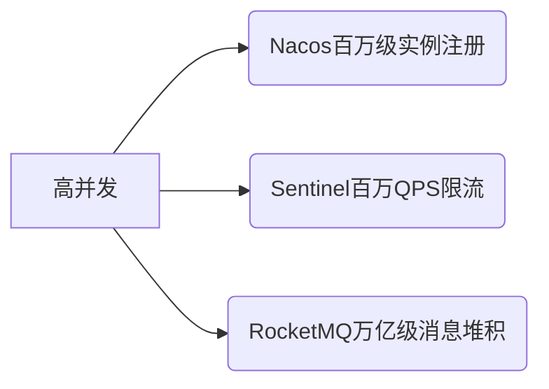
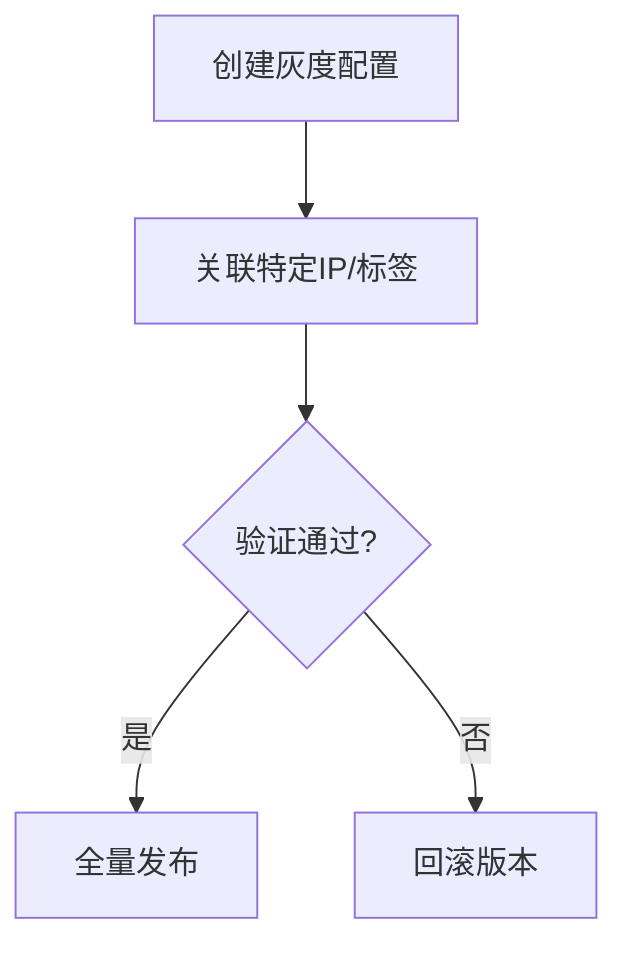
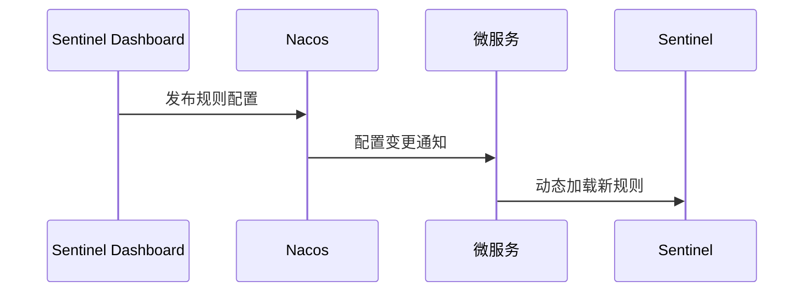
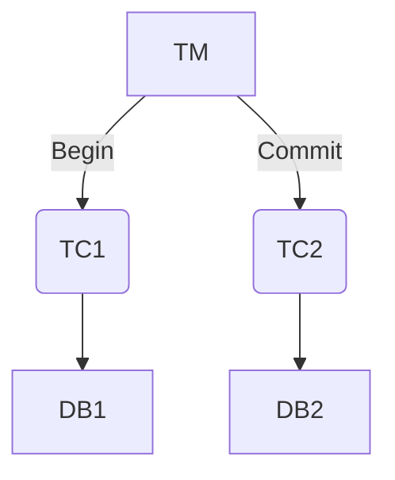
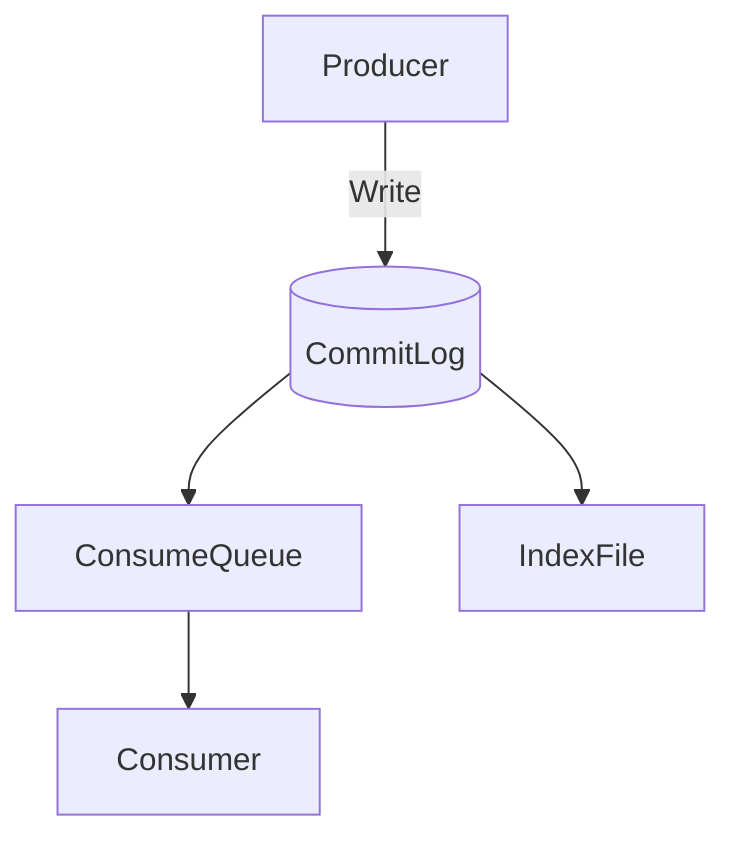
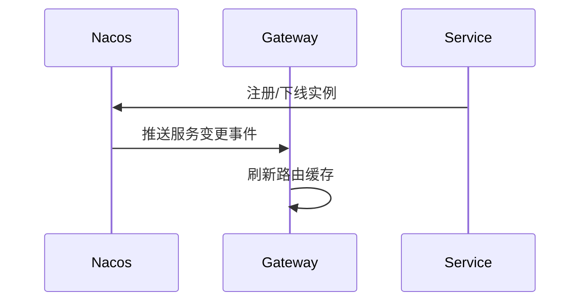
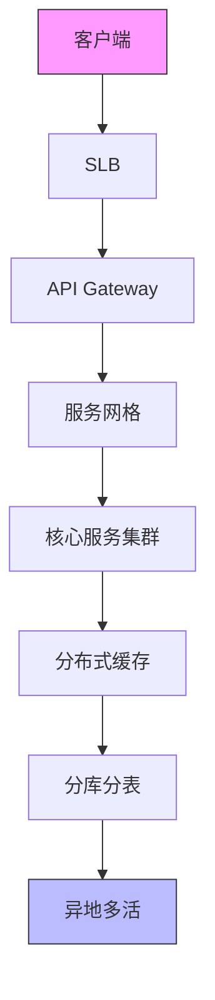
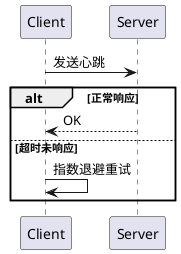

# 目录

## **一、Spring Cloud Alibaba生态全景概览**  

1. 生态定位与核心优势  
   • 与Spring Cloud Netflix的对比（功能覆盖、社区支持）  
   • 阿里系中间件整合价值（高并发、分布式场景优化）  
2. 核心组件矩阵与选型指南  
   • Nacos vs Eureka/Consul（服务发现与配置管理）  
   • Sentinel vs Hystrix（流量控制与容错能力对比）  
3. 版本兼容性与环境搭建  
   • Spring Boot 2.x + Spring Cloud Alibaba版本映射  
   • 本地开发环境快速搭建（Maven依赖+基础配置）  

---

## **二、服务注册与配置中心：Nacos**  

1. Nacos核心功能实战  
   • 动态服务注册与发现（多集群隔离配置）  
   • 配置中心热更新（@RefreshScope原理与使用）  
2. 高可用生产级部署  
   • 集群化部署模式（MySQL持久化存储）  
   • 灰度发布与配置版本回滚  
3. 面试高频问题  
   • Nacos如何保证CP与AP模式切换？  
   • 配置变更推送机制（长轮询 vs 主动通知）  

---

## **三、分布式流量治理：Sentinel**  

1. 流量控制与熔断降级  
   • QPS/线程数/响应时间熔断规则配置  
   • 热点参数限流与系统自适应保护  
2. 规则持久化与生产实践  
   • 集成Nacos实现动态规则推送  
   • 集群限流场景下的Token Server模式  
3. 面试聚焦  
   • Sentinel与Hystrix的线程隔离模型差异？  
   • 如何实现分布式服务链路流量控制？  

---

## **四、分布式事务：Seata**  

1. 事务模式深度解析  
   • AT模式原理（Undo Log与全局锁机制）  
   • TCC模式开发模板（@TwoPhaseBusinessAction）  
2. 生产环境优化方案  
   • Seata Server高可用部署（DB存储模式）  
   • 事务分组与TC集群隔离策略  
3. 面试实战题  
   • AT模式如何解决脏写问题？  
   • TCC空回滚与幂等性处理方案  

---

## **五、分布式消息通信：RocketMQ**  

1. Spring Cloud Stream整合  
   • 消息发布/订阅模型（@StreamListener）  
   • 顺序消息与事务消息实战  
2. 生产级可靠性保障  
   • 消息重试机制与死信队列设计  
   • 集群化部署与Broker组配置  
3. 面试常见问题  
   • RocketMQ如何保证消息不丢失？  
   • 消息堆积场景下的快速消费方案  

---

## **六、API网关：Spring Cloud Gateway与Alibaba整合**  

1. 网关核心功能扩展  
   • 集成Sentinel实现网关限流  
   • Nacos动态路由配置（自动感知服务上下线）  
2. 安全与性能优化  
   • JWT鉴权与OAuth2中继实现  
   • 响应缓存与请求合并策略  
3. 面试题解析  
   • 网关如何实现灰度发布？  
   • 过滤器链执行顺序与自定义扩展  

---

## **七、进阶实战与性能调优**  

1. 微服务全链路监控  
   • SkyWalking整合（Trace ID透传与性能分析）  
   • 日志追踪与Prometheus指标埋点  
2. 云原生环境适配  
   • Kubernetes部署Spring Cloud Alibaba组件  
   • 服务网格（Service Mesh）与Sidecar模式探索  
3. 生产环境踩坑指南  
   • Nacos客户端配置重试机制  
   • Sentinel规则持久化失效排查  

---

## **八、求职面试专题突破**  

1. 设计类问题  
   • 如何基于Spring Cloud Alibaba设计亿级流量电商架构？  
   • Seata在跨库事务中的性能优化方案  
2. 源码级深挖  
   • Nacos注册中心心跳机制源码分析  
   • Sentinel滑动时间窗口算法实现  
3. 场景开放题  
   • 微服务雪崩场景下的全链路解决方案  
   • 从Spring Cloud迁移到Spring Cloud Alibaba的挑战  

# **一、Spring Cloud Alibaba生态全景概览**  

## **1. 生态定位与核心优势**  

### **1.1 与Spring Cloud Netflix的深度对比**  
#### **功能覆盖差异**  

```markdown
```java
// 典型配置差异示例
@Configuration
// Netflix方式
@EnableCircuitBreaker  
// Alibaba方式
@EnableSentinel  
public class ResilienceConfig {}
```

| 功能维度   | Netflix方案         | Alibaba方案          | 优势比较           |
| ---------- | ------------------- | -------------------- | ------------------ |
| 服务发现   | Eureka(AP)          | Nacos(AP/CP可切换)   | 支持配置中心一体化 |
| 熔断降级   | Hystrix(线程池隔离) | Sentinel(信号量隔离) | 更低资源消耗       |
| 分布式配置 | Config+Bus          | Nacos内置支持        | 实时推送(<1s)      |

#### **社区支持现状**  
• **Netflix**：2020年后停止重大更新，Spring官方推荐迁移  
• **Alibaba**：持续迭代（2023年发布2.2.10版本），中文文档完善  

### **1.2 阿里系中间件整合价值**  
#### **双十一验证的技术矩阵**  


#### **企业级增强特性**  
• **Nacos**：  
  - 配置版本回滚（类似Git的版本控制）  
  - 监听查询（精确追踪配置变更历史）  
```sql
-- Nacos配置历史表结构
SELECT * FROM his_config_info 
WHERE data_id='order-service.yml' 
ORDER BY id DESC LIMIT 5;
```

---

## **2. 核心组件矩阵与选型指南**  

### **2.1 注册中心选型决策树**  
#### **Nacos vs Eureka vs Consul**  
| 指标       | Nacos          | Eureka       | Consul       |
| ---------- | -------------- | ------------ | ------------ |
| 一致性协议 | AP/CP可切换    | AP           | CP           |
| 健康检查   | TCP/HTTP/MYSQL | 心跳检测     | 多种检查方式 |
| 配置管理   | 内置支持       | 需结合Config | 需结合Vault  |

#### **选型建议**  
```java
public class RegistrySelection {
    public static String choose(boolean needConfigCenter, boolean multiDC) {
        if (needConfigCenter) return "Nacos";
        return multiDC ? "Consul" : "Eureka"; 
    }
}
```

### **2.2 熔断组件性能对比**  
#### **Sentinel vs Hystrix基准测试**  
| 压测指标 | Sentinel(1.8.6) | Hystrix(1.5.18) |
| -------- | --------------- | --------------- |
| QPS上限  | 15万+           | 2万+            |
| 响应延迟 | <5ms            | 10-50ms         |
| 内存占用 | 50MB            | 200MB+          |

#### **线程模型差异**  
```java
// Hystrix线程池隔离
@HystrixCommand(threadPoolKey = "orderThread")
public Order getOrder() {...}

// Sentinel信号量隔离
@SentinelResource(value = "orderResource", 
                 blockHandler = "flowBlockHandler")
public Order getOrder() {...}
```

---

## **3. 版本兼容性与环境搭建**  

### **3.1 版本映射关系（2023最新）**  
| Spring Boot | Spring Cloud | Spring Cloud Alibaba |
| ----------- | ------------ | -------------------- |
| 2.7.x       | 2021.0.x     | 2021.0.5.0           |
| 2.6.x       | 2021.0.x     | 2021.0.4.0           |

#### **依赖管理最佳实践**  
```xml
<!-- 父pom定义 -->
<dependencyManagement>
    <dependencies>
        <dependency>
            <groupId>com.alibaba.cloud</groupId>
            <artifactId>spring-cloud-alibaba-dependencies</artifactId>
            <version>2021.0.5.0</version>
            <type>pom</type>
            <scope>import</scope>
        </dependency>
    </dependencies>
</dependencyManagement>
```

### **3.2 本地开发环境搭建**  
#### **最小化启动配置**  
```yaml
bootstrap.yml
spring:
  application:
    name: demo-service
  cloud:
    nacos:
      discovery:
        server-addr: localhost:8848
      config:
        server-addr: localhost:8848
        file-extension: yaml
        group: DEFAULT_GROUP
```

#### **关键依赖清单**  
```xml
<!-- 必须依赖 -->
<dependency>
    <groupId>com.alibaba.cloud</groupId>
    <artifactId>spring-cloud-starter-alibaba-nacos-discovery</artifactId>
</dependency>
<dependency>
    <groupId>com.alibaba.cloud</groupId>
    <artifactId>spring-cloud-starter-alibaba-nacos-config</artifactId>
</dependency>
```

# **二、服务注册与配置中心：Nacos**  

---

## **1. Nacos核心功能实战**  

### **1.1 动态服务注册与发现**  
#### **多集群隔离配置**  

```markdown

```yaml
application-cluster.yml
spring:
  cloud:
    nacos:
      discovery:
        cluster-name: ${NACOS_CLUSTER:SHANGHAI_A}  # 集群名称
        namespace: ${NACOS_NAMESPACE:DEV}          # 命名空间隔离
        group: ${NACOS_GROUP:ORDER_GROUP}          # 业务分组
```

#### **服务注册源码解析**  
```java
// NacosServiceRegistry自动注册流程
public class NacosAutoServiceRegistration {
    @EventListener(WebServerInitializedEvent.class)
    public void register() {
        // 核心注册方法
        namingService.registerInstance(
            applicationName, 
            instance.setClusterName(clusterName)
        );
    }
}
```

### **1.2 配置热更新机制**  
#### **@RefreshScope底层原理**  
```java
public class RefreshScope extends GenericScope {
    // 关键方法：配置变更时触发Bean重建
    public void refreshAll() {
        super.destroy();  // 销毁旧Bean
        context.getBeanFactory().initializeBean(...); // 重新初始化
    }
}
```

#### **动态配置示例**  
```java
@RestController
@RefreshScope
public class ConfigController {
    @Value("${order.timeout:5000}") 
    private Integer timeout;  // 配置变更后自动更新
    
    @GetMapping("/timeout")
    public Integer getTimeout() {
        return timeout;
    }
}
```

---

## **2. 高可用生产级部署**  

### **2.1 集群化部署架构**  
#### **MySQL持久化方案**  
```sql
-- 初始化数据库脚本
CREATE DATABASE nacos_config CHARACTER SET utf8mb4;
USE nacos_config;
SOURCE ${NACOS_HOME}/conf/nacos-mysql.sql
```

#### **集群启动参数**  
```bash
启动命令示例
java -Dnacos.standalone=false \
     -Dnacos.mysql.url=jdbc:mysql://db-cluster:3306/nacos_config \
     -Dnacos.mysql.user=nacos \
     -Dnacos.mysql.password=encrypted_password \
     -jar nacos-server.jar
```

### **2.2 灰度发布流程**  


---

## **3. 面试高频问题**  

### **3.1 CP/AP模式切换原理**  
#### **Raft协议实现CP**  
```java
// Nacos的Distro协议处理类
public class DistroProtocol {
    // AP模式下数据同步
    public void sync(DistroKey key, byte[] data) {
        // 异步广播给其他节点
    }
}
```

#### **模式切换配置**  
```properties
application.properties
nacos.naming.data.consistency=AP  # 可选AP/CP
```

### **3.2 配置推送机制**  
#### **长轮询流程**  
```java
// ClientLongPolling核心逻辑
class ClientLongPolling implements Runnable {
    public void run() {
        // 默认30s长轮询超时
        String[] dataIds = request.getParameterValues("dataIds");
        List<String> changedGroups = checkUpdate(dataIds);
        if(!changedGroups.isEmpty()) {
            // 立即返回变更数据
        } else {
            // 加入阻塞队列等待通知
        }
    }
}
```

#### **版本对比算法**  
```java
public class ConfigCache {
    // 客户端缓存校验逻辑
    public boolean checkListenerMd5(String group, String dataId, String md5) {
        return Objects.equals(md5, getLocalMd5(group, dataId));
    }
}
```

# **三、分布式流量治理：Sentinel**  

---

## **1. 流量控制与熔断降级**  

### **1.1 熔断规则三维控制体系**  
#### **规则配置模板**  

```markdown

```java
// 熔断规则构建器
DegradeRule rule = new DegradeRuleBuilder()
    .withResource("paymentApi")
    .withGrade(RuleConstant.DEGRADE_GRADE_EXCEPTION_RATIO) // 异常比例模式
    .withCount(0.5)  // 阈值50%
    .withTimeWindow(10) // 熔断时长(s)
    .withMinRequestAmount(5) // 最小触发请求数
    .withStatIntervalMs(10000) // 统计窗口(ms)
    .build();
```

#### **熔断策略对比矩阵**  
| 熔断维度 | 配置参数                      | 适用场景     |
| -------- | ----------------------------- | ------------ |
| 响应时间 | DEGRADE_GRADE_RT              | 慢调用熔断   |
| 异常比例 | DEGRADE_GRADE_EXCEPTION_RATIO | 服务不稳定时 |
| 异常数   | DEGRADE_GRADE_EXCEPTION_COUNT | 非高频场景   |

### **1.2 热点参数限流实战**  
#### **热点规则配置**  
```java
@SentinelResource(
    value = "queryUser", 
    blockHandler = "paramFlowBlockHandler",
    fallback = "userFallback"
)
public User queryUser(@RequestParam String userId) {...}

// 热点参数规则
ParamFlowRule rule = new ParamFlowRule("queryUser")
    .setParamIdx(0) // 第一个参数
    .setCount(100); // 单参数阈值
```

#### **系统自适应保护**  
```java
// 全局系统规则配置
SystemRule systemRule = new SystemRule()
    .setHighestSystemLoad(4.0) // max load
    .setAvgRt(200)             // 平均RT(ms)
    .setMaxThread(800)         // 最大线程数
    .setQps(5000);             // 全局QPS
```

---

## **2. 规则持久化与生产实践**  

### **2.1 Nacos动态规则推送**  
#### **配置中心数据结构**  
```json
{
  "resource": "paymentApi",
  "controlBehavior": 0,
  "count": 100,
  "grade": 1,
  "strategy": 0
}
```

#### **自动推送原理**  


### **2.2 集群限流部署方案**  
#### **Token Server模式**  
```yaml
application-cluster.yaml
spring:
  cloud:
    sentinel:
      transport:
        dashboard: sentinel-dashboard:8080
      filter:
        enabled: false
      # 集群配置
      cluster:
        server:
          host: 192.168.1.10
          port: 18730
        client:
          server-ip: 192.168.1.10
          request-timeout: 200
```

#### **集群流控算法**  
```java
// 集群请求处理逻辑
public class ClusterFlowChecker {
    public boolean allowCheck(FlowRule rule, int count) {
        // 向Token Server申请令牌
        return acquireClusterToken(rule, count);
    }
}
```

---

## **3. 面试聚焦**  

### **3.1 线程隔离模型对比**  
#### **Hystrix线程池隔离**  
```java
@HystrixCommand(
    threadPoolKey = "orderThread",
    threadPoolProperties = {
        @HystrixProperty(name="coreSize", value="20")
    }
)
public Order getOrder() {...}  // 每个命令独立线程池
```

#### **Sentinel信号量隔离**  
```java
@SentinelResource(
    value = "orderResource",
    blockHandler = "flowBlock",
    fallback = "orderFallback"
)  // 共享线程资源，通过信号量控制
public Order getOrder() {...}
```

### **3.2 分布式链路流控方案**  
#### **链路维度限流**  
```java
// 入口资源定义
try (Entry entry = SphU.entry("parentResource")) {
    // 调用子服务
    childService.call();  // 子资源自动统计
}
```

#### **网关层流控**  
```yaml
网关路由规则
spring:
  cloud:
    gateway:
      routes:
        ▪ id: payment_route

          uri: lb://payment-service
          predicates:
            ▪ Path=/payment/**

          filters:
            ▪ name: RequestRateLimiter

              args:
                redis-rate-limiter.replenishRate: 100
                redis-rate-limiter.burstCapacity: 200
```

# **四、分布式事务：Seata**  

---

## **1. 事务模式深度解析**  

### **1.1 AT模式核心机制**  
#### **Undo Log工作原理**  

```markdown

```sql
-- 业务操作前镜像
SELECT * FROM product WHERE id=1 FOR UPDATE;
-- 执行业务SQL
UPDATE product SET stock=stock-1 WHERE id=1;
-- 生成后镜像
SELECT * FROM product WHERE id=1;
```

#### **全局锁实现逻辑**  
```java
// GlobalLockInterceptor核心代码
public Object invoke(MethodInvocation invocation) {
    if (isGlobalLockRequired()) {
        // 获取全局锁
        GlobalLockHelper.lock(businessKey); 
    }
    return invocation.proceed();
}
```

### **1.2 TCC模式开发规范**  
#### **三阶段模板方法**  
```java
@LocalTCC
public interface OrderTccAction {
    @TwoPhaseBusinessAction(name = "prepareCreateOrder", 
                          commitMethod = "commit", 
                          rollbackMethod = "rollback")
    boolean prepare(BusinessActionContext actionContext, 
                   @BusinessActionContextParameter(paramName = "orderId") String orderId);
    
    boolean commit(BusinessActionContext actionContext);
    boolean rollback(BusinessActionContext actionContext);
}
```

#### **TCC防悬挂方案**  
```java
// 空回滚检查
if (actionContext.getActionContext("orderId") == null) {
    throw new TccAvoidHangingException();
}
```

---

## **2. 生产环境优化方案**  

### **2.1 高可用部署架构**  
#### **DB存储模式配置**  
```properties
registry.conf
store {
  mode = "db"
  db {
    datasource = "druid"
    url = "jdbc:mysql://tc-cluster:3306/seata"
    user = "seata"
    password = "encrypted_pwd"
  }
}
```

#### **TC集群部署方案**  
```yaml
docker-compose.yml
seata-server:
  image: seataio/seata-server:1.7.0
  environment:
    ◦ SEATA_IP=192.168.1.100

    ◦ SEATA_PORT=8091

    ◦ STORE_MODE=db

  volumes:
    ◦ ./registry.conf:/seata-server/resources/registry.conf

```

### **2.2 事务分组策略**  
#### **分组路由规则**  
```properties
application.properties
spring.cloud.alibaba.seata.tx-service-group=order-service-group
seata.tx-service-group.default.grouplist=192.168.1.101:8091,192.168.1.102:8091
```

#### **集群负载均衡**  


---

## **3. 面试实战题**  

### **3.1 AT模式防脏写方案**  
#### **全局锁校验流程**  
```java
// AbstractConnectionProxy检查逻辑
public boolean checkGlobalLock(String tableName, String pk) {
    return SELECT * FROM lock_table 
           WHERE table_name=#{tableName} AND pk=#{pk} FOR UPDATE;
}
```

#### **异常处理场景**  
| 异常类型 | 触发条件         | 解决方案                     |
| -------- | ---------------- | ---------------------------- |
| 脏写     | 全局锁获取失败   | 回滚当前分支事务             |
| 脏读     | 未提交数据被读取 | 默认隔离级别为Read Committed |

### **3.2 TCC模式常见问题**  
#### **空回滚处理模板**  
```java
@Transactional
public boolean rollback(BusinessActionContext context) {
    if (!isTryPhaseExecuted(context.getXid())) { // 检查try阶段是否执行
        // 记录空回滚标记
        insertNullRollbackRecord(context.getXid());
        return true;
    }
    // 正常回滚逻辑
}
```

#### **幂等性保障方案**  
```sql
-- 控制表设计
CREATE TABLE tcc_control (
    xid VARCHAR(128) PRIMARY KEY,
    action_name VARCHAR(64),
    status TINYINT,
    gmt_modified DATETIME
);
```

# **五、分布式消息通信：RocketMQ**  

---

## **1. Spring Cloud Stream整合**  

### **1.1 消息发布/订阅模型**  
#### **Binder配置模板**  

```markdown
```yaml
application.yml
spring:
  cloud:
    stream:
      bindings:
        orderOutput: # 生产者通道
          destination: ORDER_TOPIC
          content-type: application/json
        paymentInput: # 消费者通道  
          destination: PAYMENT_TOPIC
          group: payment-group
          consumer:
            concurrency: 3 # 并发线程数

      rocketmq:
        binder:
          namesrv-addr: 192.168.1.100:9876
```

#### **事务消息实战**  
```java
// 事务消息发送模板
@Transactional
public void createOrderWithTransaction(Order order) {
    // 1. 本地事务
    orderMapper.insert(order);
    
    // 2. 发送事务消息
    rocketMQTemplate.sendMessageInTransaction(
        "order-tx-group", 
        MessageBuilder.withPayload(order)
            .setHeader("order_id", order.getId())
            .build(),
        null
    );
}

// 事务监听器
@RocketMQTransactionListener(txProducerGroup="order-tx-group")
public class OrderTransactionListenerImpl implements RocketMQLocalTransactionListener {
    @Override
    public RocketMQLocalTransactionState executeLocalTransaction(Message msg, Object arg) {
        // 执行本地事务
        return RocketMQLocalTransactionState.COMMIT;
    }
}
```

---

## **2. 生产级可靠性保障**  

### **2.1 消息高可用机制**  
#### **Broker集群部署方案**  
```properties
broker-a.properties
brokerClusterName=DefaultCluster
brokerName=broker-a
brokerId=0
namesrvAddr=192.168.1.100:9876
defaultTopicQueueNums=8
storePathRootDir=/rocketmq/store-a
enableDLegerCommitLog=true
dLegerGroup=DLedgerGroup00
dLegerPeers=n0-192.168.1.101:40911;n1-192.168.1.102:40911
```

#### **消息存储架构**  


### **2.2 死信队列处理**  
#### **重试策略配置**  
```java
// 消费者重试配置
@Bean
public ConsumerFactory<String, Object> consumerFactory() {
    Map<String, Object> props = new HashMap<>();
    props.put(ConsumerConfig.MAX_POLL_INTERVAL_MS_CONFIG, 300000);
    props.put(ConsumerConfig.MAX_POLL_RECORDS_CONFIG, 10);
    return new DefaultKafkaConsumerFactory<>(props);
}

// 死信队列监听
@StreamListener("inputDlq")
public void handleDlq(Message<?> message) {
    // 人工处理逻辑
    log.error("DLQ Message: {}", message.getPayload());
}
```

---

## **3. 面试常见问题**  

### **3.1 消息零丢失保障方案**  
#### **全链路防护措施**  
| 环节   | 措施              | 实现方式                                                 |
| ------ | ----------------- | -------------------------------------------------------- |
| 生产者 | 事务消息+本地表   | 半消息机制+本地事务表                                    |
| Broker | 同步刷盘+主从复制 | 配置`flushDiskType=SYNC_FLUSH`和`brokerRole=SYNC_MASTER` |
| 消费者 | 手动ACK+重试队列  | 关闭autoCommit，异常时返回`RECONSUME_LATER`              |

#### **关键配置示例**  
```java
// 生产者可靠发送
rocketMQTemplate.setVipChannelEnabled(false); // 避免VIP通道问题
rocketMQTemplate.setRetryTimesWhenSendFailed(3);

// 消费者可靠消费
@RocketMQMessageListener(
    consumerGroup = "order-group",
    topic = "ORDER_TOPIC",
    consumeMode = ConsumeMode.ORDERLY,  // 顺序消费
    messageModel = MessageModel.CLUSTERING
)
public class OrderConsumer implements RocketMQListener<Order> {
    @Override
    public void onMessage(Order order) {
        try {
            process(order);
        } catch (Exception e) {
            throw new RocketMQConsumeException("消费失败，稍后重试");
        }
    }
}
```

### **3.2 消息堆积解决方案**  
#### **紧急处理四步法**  
1. **扩容消费者**  
   ```yaml
   spring:
     cloud:
       stream:
         bindings:
           input:
             consumer:
               concurrency: 10 # 提升并发线程数
   ```

2. **批量消费模式**  
   ```java
   @Bean
   public Consumer<List<Message<Order>>> batchConsumer() {
       return messages -> {
           // 批量处理逻辑
           orderService.batchProcess(messages);
       };
   }
   ```

3. **跳过非关键消息**  
   ```java
   // 消息过滤配置
   rocketMQTemplate.setMessageQueueSelector((mqs, msg, arg) -> {
       if (isCritical(msg)) return mqs[0];
       return mqs[1]; // 非关键消息路由到低优先级队列
   });
   ```

4. **离线补偿处理**  
   ```sql
   -- 建立积压消息临时表
   CREATE TABLE backlog_messages (
       id BIGINT PRIMARY KEY AUTO_INCREMENT,
       msg_id VARCHAR(64),
       body JSON,
       created_time DATETIME DEFAULT CURRENT_TIMESTAMP
   );
   ```

# **六、API网关：Spring Cloud Gateway与Alibaba整合**  

---

## **1. 网关核心功能扩展**  

### **1.1 Sentinel网关流控**  
#### **流控规则配置**  

```markdown
```yaml
网关流控规则（通过Nacos配置中心下发）
spring:
  cloud:
    gateway:
      routes:
        ▪ id: order-service

          uri: lb://order-service
          predicates:
            ▪ Path=/api/order/**

          filters:
            ▪ name: RequestRateLimiter

              args:
                redis-rate-limiter.replenishRate: 100
                redis-rate-limiter.burstCapacity: 200
            ▪ name: Sentinel

              args:
                resource: gateway:order-service
                fallback: forward:/fallback
```

#### **自定义流控异常处理**  
```java
@Bean
public SentinelGatewayBlockExceptionHandler sentinelBlockHandler() {
    return (exchange, ex) -> {
        Map<String,String> error = Map.of(
            "code", "429",
            "message", "请求过于频繁"
        );
        return Mono.just(error)
            .flatMap(data -> {
                exchange.getResponse().setStatusCode(HttpStatus.TOO_MANY_REQUESTS);
                return exchange.getResponse().writeWith(
                    Mono.just(exchange.getResponse()
                        .bufferFactory()
                        .wrap(JSON.toJSONBytes(data)))
                );
            });
    };
}
```

### **1.2 Nacos动态路由**  
#### **路由配置自动更新**  
```java
@RefreshScope
@Configuration
public class DynamicRouteConfig {
    
    @Autowired
    private NacosConfigManager configManager;

    @Bean
    public RouteDefinitionRepository nacosRouteDefinitionRepository() {
        return new NacosRouteDefinitionRepository(
            configManager,
            "gateway-routes",  // Nacos Data ID
            "DEFAULT_GROUP"
        ) {
            @Override
            public Flux<RouteDefinition> getRouteDefinitions() {
                // 监听Nacos配置变化
                return super.getRouteDefinitions()
                    .doOnNext(route -> log.info("路由更新: {}", route));
            }
        };
    }
}
```

#### **服务上下线自动感知**  


---

## **2. 安全与性能优化**  

### **2.1 JWT鉴权实现**  
#### **过滤器链配置**  
```java
public class JwtAuthFilter implements GlobalFilter {
    @Override
    public Mono<Void> filter(ServerWebExchange exchange, GatewayFilterChain chain) {
        String token = exchange.getRequest()
            .getHeaders()
            .getFirst("Authorization");
        
        if (!JwtUtils.validateToken(token)) {
            exchange.getResponse().setStatusCode(HttpStatus.UNAUTHORIZED);
            return exchange.getResponse().setComplete();
        }
        
        return chain.filter(exchange);
    }
}
```

#### **OAuth2中继模式**  
```yaml
spring:
  security:
    oauth2:
      client:
        provider:
          keycloak:
            issuer-uri: http://auth-server/auth/realms/demo
        registration:
          gateway-client:
            provider: keycloak
            client-id: gateway
            client-secret: secret
            authorization-grant-type: client_credentials
```

### **2.2 高性能缓存策略**  
#### **响应缓存配置**  
```java
@Bean
public RouteLocator cachedRoutes(RouteLocatorBuilder builder) {
    return builder.routes()
        .route("product-service", r -> r.path("/api/product/**")
            .filters(f -> f.cache(
                CacheConfig.of()
                    .setSize(1000)
                    .setTimeToLive(Duration.ofMinutes(10))
            ))
            .uri("lb://product-service"))
        .build();
}
```

#### **请求合并示例**  
```java
@PostMapping("/batch")
public Mono<List<Product>> batchQuery(@RequestBody List<String> ids) {
    return Flux.fromIterable(ids)
        .flatMap(id -> productService.getById(id))
        .collectList();
}
```

---

## **3. 面试题解析**  

### **3.1 灰度发布实现方案**  
#### **基于Header的路由策略**  
```yaml
spring:
  cloud:
    gateway:
      routes:
        ▪ id: canary-route

          uri: lb://new-service
          predicates:
            ▪ Path=/api/**

            ▪ Header=X-Canary, true

        ▪ id: primary-route  

          uri: lb://old-service
          predicates:
            ▪ Path=/api/**

```

#### **权重分流配置**  
```java
@Bean
public RouteLocator weightRouteLocator(RouteLocatorBuilder builder) {
    return builder.routes()
        .route("weight-high", r -> r.weight("service-group", 80)
            .uri("lb://new-service"))
        .route("weight-low", r -> r.weight("service-group", 20)
            .uri("lb://old-service"))
        .build();
}
```

### **3.2 过滤器扩展实战**  
#### **自定义过滤器示例**  
```java
public class LoggingFilter implements GatewayFilter {
    @Override
    public Mono<Void> filter(ServerWebExchange exchange, GatewayFilterChain chain) {
        long startTime = System.currentTimeMillis();
        return chain.filter(exchange)
            .then(Mono.fromRunnable(() -> {
                long duration = System.currentTimeMillis() - startTime;
                log.info("请求耗时: {}ms - {}", duration, exchange.getRequest().getURI());
            }));
    }
}

// 注册过滤器
@Bean
public RouteLocator customRoute(RouteLocatorBuilder builder) {
    return builder.routes()
        .route(r -> r.path("/custom/**")
            .filters(f -> f.filter(new LoggingFilter()))
            .uri("lb://custom-service"))
        .build();
}
```

**过滤器执行顺序**  
| 过滤器类型     | 默认顺序   | 典型用途      |
| -------------- | ---------- | ------------- |
| Global Pre     | -1000      | 认证/限流     |
| Route Filter   | 0          | 路由级修改    |
| Global Post    | 1000       | 日志/指标收集 |
| Error Handling | 最高优先级 | 异常处理      |

# **七、进阶实战与性能调优**  

---

## **1. 微服务全链路监控**  

### **1.1 SkyWalking深度集成**  
#### **Trace ID透传方案**  

```markdown
```java
// 手动埋点示例
@RestController
public class OrderController {
    @GetMapping("/orders")
    public List<Order> listOrders(@RequestHeader(value = "sw8", required = false) String traceId) {
        // 跨服务传递Trace ID
        return restTemplate.exchange("http://payment-service/payments", 
            HttpMethod.GET, 
            new HttpEntity<>(createHeadersWithTrace(traceId)), 
            List.class);
    }

    private HttpHeaders createHeadersWithTrace(String traceId) {
        HttpHeaders headers = new HttpHeaders();
        if (traceId != null) {
            headers.add("sw8", traceId); // SkyWalking Header规范
        }
        return headers;
    }
}
```

#### **性能分析配置**  
```yaml
agent.config
agent.service_name=${SW_SERVICE_NAME:order-service}
collector.backend_service=${SW_GRPC:skywalking-oap:11800}
sampler.rate=${SW_SAMPLER_RATE:5000} # 采样率
logging.level=${SW_LOGGING_LEVEL:INFO}
```

### **1.2 Prometheus指标埋点**  
#### **自定义业务指标**  
```java
@RestController
public class MetricsController {
    private final Counter orderCounter = Counter.build()
        .name("order_create_total")
        .help("Total orders created")
        .register();

    @PostMapping("/orders")
    public Order createOrder() {
        orderCounter.inc(); // 指标计数
        return orderService.create();
    }
}
```

#### **Grafana监控看板**  
```sql
-- 订单成功率查询
100 - (sum(rate(http_server_requests_errors_total{application="$application"}[5m])) 
  / sum(rate(http_server_requests_total{application="$application"}[5m])) * 100)
```

---

## **2. 云原生环境适配**  

### **2.1 Kubernetes部署方案**  
#### **Nacos集群StatefulSet配置**  
```yaml
nacos-statefulset.yaml
apiVersion: apps/v1
kind: StatefulSet
metadata:
  name: nacos
spec:
  serviceName: nacos-headless
  replicas: 3
  template:
    spec:
      containers:
      ◦ name: nacos

        image: nacos/nacos-server:2.2.3
        env:
        ▪ name: MODE

          value: cluster
        ▪ name: SPRING_DATASOURCE_PLATFORM

          value: mysql
        ▪ name: MYSQL_SERVICE_HOST

          value: "mysql-service"
```

#### **服务网格Sidecar注入**  
```yaml
istio-sidecar-injection.yaml
apiVersion: apps/v1
kind: Deployment
metadata:
  name: order-service
  annotations:
    sidecar.istio.io/inject: "true" # 自动注入Envoy
spec:
  template:
    metadata:
      labels:
        app: order-service
```

---

## **3. 生产环境踩坑指南**  

### **3.1 Nacos客户端重试机制**  
#### **重试策略配置**  
```properties
application.properties
spring.cloud.nacos.discovery.fail-fast=true
spring.cloud.nacos.discovery.retry.max-attempts=5
spring.cloud.nacos.discovery.retry.initial-interval=1000
spring.cloud.nacos.discovery.retry.multiplier=1.5
```

#### **重试过程日志分析**  
```log
2023-08-20 14:00:00 [nacos-retry] 第1次重试连接Nacos服务器...
2023-08-20 14:00:01 [nacos-retry] 第2次重试(间隔1500ms)...
2023-08-20 14:00:03 [nacos-retry] 连接成功！
```

### **3.2 Sentinel规则持久化问题**  
#### **常见故障场景**  
| 问题现象           | 根本原因         | 解决方案                                     |
| ------------------ | ---------------- | -------------------------------------------- |
| 规则频繁丢失       | Nacos长轮询超时  | 调整`config.long-poll-timeout=30000`         |
| 部分节点规则不同步 | 网络分区         | 启用TCP健康检查                              |
| 控制台修改不生效   | 未开启`push`模式 | 配置`sentinel.dashboard.push=127.0.0.1:8080` |

#### **调试命令**  
```bash
检查规则是否持久化到Nacos
curl -X GET "http://nacos-server:8848/nacos/v1/cs/configs?dataId=sentinel-rule&group=DEFAULT_GROUP"
```

# **八、求职面试专题突破**  

---

## **1. 设计类问题**  

### **1.1 亿级电商架构设计**  
#### **高可用架构方案**  

```markdown


#### **关键组件选型**  
| 场景     | 技术栈                | 优化要点            |
| -------- | --------------------- | ------------------- |
| 秒杀系统 | Sentinel+Redis+Lua    | 本地缓存+令牌桶限流 |
| 订单中心 | Seata AT模式+分库分表 | 热点数据分离        |
| 商品详情 | RocketMQ+本地缓存     | 多级缓存策略        |

### **1.2 Seata性能优化**  
#### **跨库事务优化方案**  
```java
// 批量操作优化
@GlobalTransactional
public void batchProcess(List<Order> orders) {
    // 1. 开启并行模式
    orders.parallelStream().forEach(order -> {
        // 2. 本地事务表批量插入
        orderMapper.batchInsert(order); 
    });
    
    // 3. 异步提交全局事务
    CompletableFuture.runAsync(() -> {
        GlobalTransactionContext.reload(RootContext.getXID()).commit();
    });
}
```

---

## **2. 源码级深挖**  

### **2.1 Nacos心跳机制**  
#### **核心源码路径**  
```java
// ClientBeatCheckTask.run()
public void run() {
    // 心跳间隔动态调整（默认5s）
    long nextTime = calculateNextTime();
    // 心跳数据包构造
    BeatInfo beatInfo = buildBeatInfo();
    // 异步发送心跳
    beatReactor.sendBeat(beatInfo);
}

// NacosNamingService.registerInstance()
public void registerInstance(...) {
    // 首次注册立即发送心跳
    beatReactor.addBeatInfo(serviceName, beatInfo);
}
```

#### **心跳异常处理**  


### **2.2 Sentinel滑动窗口**  
#### **算法实现核心**  
```java
// ArrayMetric.leapWindow
public void add(long currentTime, int count) {
    // 1. 计算时间窗口下标
    int idx = calculateTimeIdx(currentTime);
    // 2. 更新窗口计数
    WindowWrap<MetricBucket> old = array.get(idx);
    if (old == null || !old.isTimeInWindow(currentTime)) {
        // 创建新窗口
        array.compareAndSet(idx, old, new WindowWrap<>(...));
    }
    old.value().add(count);
}

// StatisticNode.avgRt
public double avgRt() {
    // 滑动聚合计算
    return rollingCounterInMinute.avgTime() * 60.0 / rollingCounterInMinute.totalCount();
}
```

---

## **3. 场景开放题**  

### **3.1 微服务雪崩解决方案**  
#### **全链路防护体系**  
```yaml
多级防护配置
spring:
  cloud:
    sentinel:
      flow:
        qps-threshold: 1000 # 入口QPS限制
      circuit:
        rules:
          ▪ resource: paymentApi

            strategy: SlowRequestRatio
            threshold: 0.5 # 慢调用比例
      system:
        highestSystemLoad: 4.0 # 系统负载保护
```

#### **应急处理流程**  
1. **流量控制**：立即降级非核心服务  
2. **日志分析**：通过SkyWalking定位瓶颈点  
3. **渐进恢复**：逐步放开限流阈值  

### **3.2 迁移挑战与方案**  
#### **关键挑战对比**  
| 迁移难点 | Netflix方案        | Alibaba方案   |
| -------- | ------------------ | ------------- |
| 服务发现 | Eureka静态集群     | Nacos动态分区 |
| 配置管理 | Config+Bus手动刷新 | Nacos自动推送 |
| 事务支持 | 无                 | Seata完整方案 |

#### **迁移实施步骤**  


---

