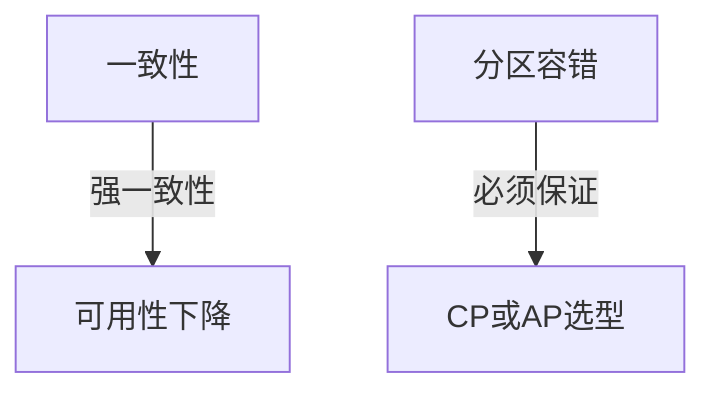
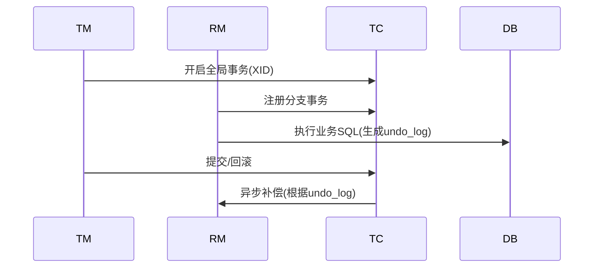
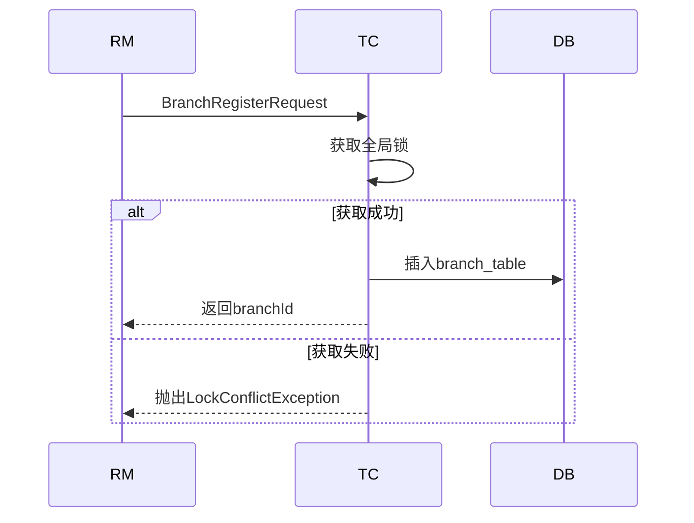
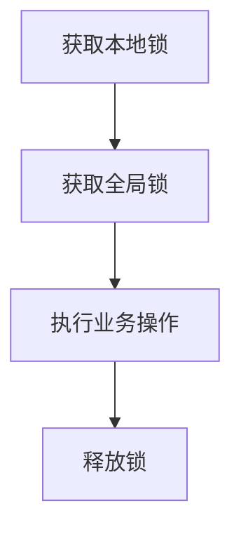
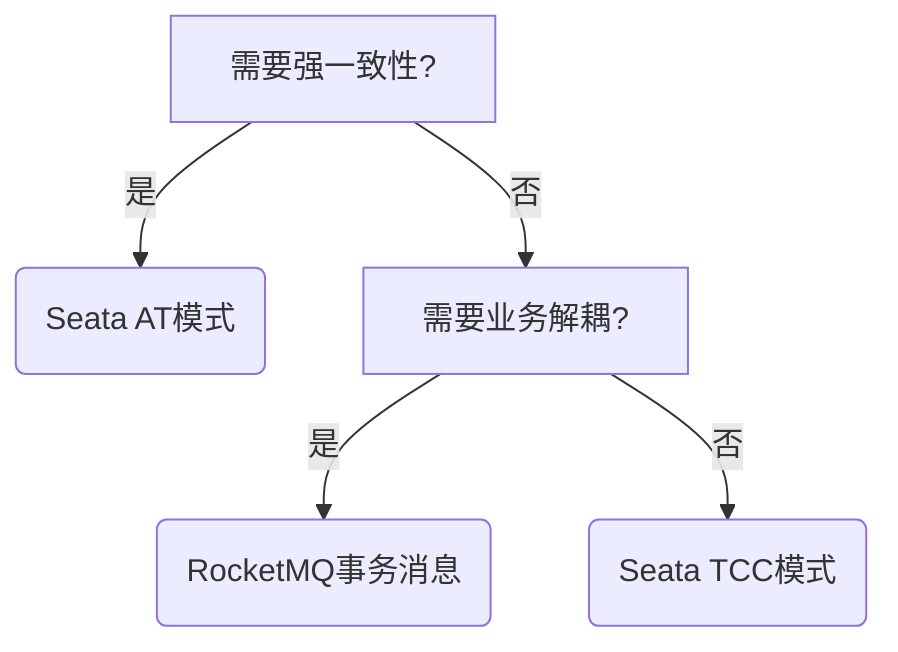

# 目录

## **1. 分布式事务核心挑战**  

1.1 CAP理论在事务中的权衡  
1.2 典型业务场景分析（跨服务扣库存案例）  

## **2. Seata事务模式详解**  
2.1 **AT模式**（自动补偿型）  
• 工作流程四阶段（TM/RM/TC协作）  
• Undo Log实现原理与全局锁机制  
2.2 **TCC模式**（柔性事务）  
• Try/Confirm/Cancel接口设计规范  
• 空回滚与幂等性保障方案  
2.3 **Saga模式**（长事务解决方案）  
• 状态机配置与异常补偿策略  

## **3. 生产环境最佳实践**  
3.1 高可用部署方案  
• TC Server集群配置（DB存储模式）  
• 事务分组与集群隔离策略  
3.2 性能优化技巧  
• 批量操作减少全局锁竞争  
• 异步提交事务实现  

## **4. 源码级原理剖析**  
4.1 全局事务ID（XID）传播机制  
4.2 分支事务注册流程源码跟踪  
4.3 事务恢复补偿机制实现  

## **5. 面试高频问题攻坚**  
5.1 AT模式如何解决脏写问题？  
5.2 TCC模式网络抖动如何处理？  
5.3 Seata与MQ事务消息的优劣对比  

## **6. 行业实战案例**  
6.1 电商订单-库存-积分事务案例  
6.2 金融行业跨行转账解决方案  

---

# **1. 分布式事务核心挑战**  

## **1.1 CAP理论在事务中的权衡**  
#### **分布式事务三难选择**  

```markdown


• **CP模式选择**：  
  ```java
  // Seata的AT模式默认CP（通过全局锁保证）
  @GlobalTransactional
  public void transfer() {
      accountService.debit();
      storageService.deduct(); 
  }
  ```
• **AP模式补偿**：  
  ```java
  // Saga模式最终一致性
  @SagaStart
  public void createOrder() {
      orderService.create();
      // 异步调用
      inventoryService.asyncDeduct(); 
  }
  ```

## **1.2 跨服务扣库存案例**  
#### **典型异常场景**  
| 故障点       | 风险                   | 现象 |
| ------------ | ---------------------- | ---- |
| 库存服务超时 | 订单已创建但库存未扣减 | 超卖 |
| 订单服务宕机 | 库存已扣减但订单未生成 | 少卖 |

#### **事务边界划分**  
```java
// 错误示范：跨服务事务不统一
public void createOrder() {
    orderDao.insert(); // 本地事务
    restTemplate.post("http://inventory/deduct"); // 非事务
}

// 正确方案：全局事务控制
@GlobalTransactional // Seata注解
public void createOrder() {
    orderService.create();
    inventoryService.deduct();
}
```

---

# **2. Seata事务模式详解**  

## **2.1 AT模式（Auto Transaction）**  
#### **四阶段工作流程**  


#### **Undo Log关键结构**  
```sql
CREATE TABLE `undo_log` (
  `id` bigint(20) NOT NULL AUTO_INCREMENT,
  `branch_id` bigint(20) NOT NULL,
  `xid` varchar(100) NOT NULL,
  `context` varchar(128) NOT NULL,
  `rollback_info` longblob NOT NULL, -- 前后镜像数据
  PRIMARY KEY (`id`),
  KEY `idx_xid` (`xid`)
) ENGINE=InnoDB DEFAULT CHARSET=utf8;
```

#### **全局锁机制**  
```java
// 获取全局锁源码片段
public boolean acquireLock() {
    // 执行SELECT FOR UPDATE
    if (tryLockWithDB()) return true;
    
    // 锁冲突时重试
    while (timeoutNotExceeded()) {
        if (tryLockWithDB()) return true;
        Thread.sleep(50); // 退避等待
    }
    throw new LockConflictException();
}
```

## **2.2 TCC模式（Try-Confirm-Cancel）**  
#### **三阶段接口规范**  
```java
@LocalTCC
public interface InventoryTccAction {
    @TwoPhaseBusinessAction(
        name = "InventoryTccAction",
        commitMethod = "confirm",
        rollbackMethod = "cancel")
    boolean try(BusinessActionContext ctx, 
               @BusinessActionContextParameter("sku") String sku,
               @BusinessActionContextParameter("count") int count);
    
    boolean confirm(BusinessActionContext ctx);
    boolean cancel(BusinessActionContext ctx);
}
```

#### **空回滚防御方案**  
```java
public boolean cancel(BusinessActionContext ctx) {
    // 检查try阶段是否执行
    if (!triedRecords.exists(ctx.getXid())) {
        log.warn("空回滚防御: {}", ctx.getXid());
        return true;
    }
    // 正常回滚逻辑
    return doCancel(ctx);
}
```

#### **幂等性保障**  
```java
@Transactional
public boolean confirm(BusinessActionContext ctx) {
    // 检查是否已处理
    if (processedRecords.contains(ctx.getXid())) {
        return true; // 幂等返回
    }
    // 业务处理
    boolean result = doConfirm(ctx);
    // 记录处理状态
    processedRecords.save(ctx.getXid());
    return result;
}
```

## **2.3 Saga模式**  
#### **状态机配置示例**  
```json
{
  "name": "orderSaga",
  "steps": [
    {
      "name": "createOrder",
      "compensate": "cancelOrder",
      "retryPolicy": {
        "maxAttempts": 3,
        "backoffPeriod": 1000
      }
    },
    {
      "name": "deductInventory",
      "compensate": "compensateInventory"
    }
  ]
}
```

#### **异常补偿策略**  
```java
public void compensateOrder(String orderId) {
    // 1. 查询订单状态
    OrderStatus status = orderDao.getStatus(orderId);
    // 2. 条件补偿
    if (status == UNPAID) {
        orderDao.cancel(orderId);
    } else {
        log.warn("订单已支付，不可撤销");
    }
}
```

---

# **3. 生产环境最佳实践**

## **3.1 高可用部署方案**
#### **TC Server集群配置（DB存储模式）**

```markdown

```yaml
registry.conf
store {
  mode = "db" # 必须使用数据库模式
  db {
    datasource = "druid"
    url = "jdbc:mysql://mysql-cluster:3306/seata?useSSL=false"
    user = "seata"
    password = "加密密码"
    min-conn = 5
    max-conn = 100
    global.table = "global_table"
    branch.table = "branch_table"
  }
}

集群节点配置（每个TC Server）
service.vgroup_mapping.default_tx_group = "cluster1"
service.cluster-name = "cluster1"
```

#### **事务分组与隔离策略**
```properties
事务分组映射（客户端配置）
spring.cloud.alibaba.seata.tx-service-group=order-service-group
seata.service.order-service-group.grouplist=192.168.1.101:8091,192.168.1.102:8091

集群隔离策略
transport.enable-client-batch-send-request=true
transport.thread-factory.boss-thread-prefix=NettyBoss
transport.thread-factory.worker-thread-prefix=NettyServerNIOWorker
```

## **3.2 性能优化技巧**
#### **批量操作优化**
```java
@GlobalTransactional
public void batchProcess(List<Order> orders) {
    // 1. 批量插入本地事务表
    orderMapper.batchInsert(orders);
    
    // 2. 合并全局锁申请
    Set<String> lockKeys = orders.stream()
        .map(o -> "order:" + o.getId())
        .collect(Collectors.toSet());
    GlobalLockHelper.lockBatch(lockKeys);
    
    // 3. 异步提交
    CompletableFuture.runAsync(() -> {
        GlobalTransactionContext.reload(RootContext.getXID()).commit();
    });
}
```

#### **异步提交实现**
```java
public class AsyncTransactionManager {
    @Async("transactionExecutor")
    public void asyncCommit(String xid) {
        try {
            GlobalTransaction tx = GlobalTransactionContext.reload(xid);
            tx.commit();
        } catch (TransactionException e) {
            log.error("异步提交失败", e);
        }
    }
}
```

---

# **4. 源码级原理剖析**

## **4.1 XID传播机制**
#### **全链路透传实现**
```java
// RootContext核心逻辑
public class RootContext {
    private static ThreadLocal<String> CONTEXT_HOLDER = new InheritableThreadLocal<>();
    
    public static void bind(String xid) {
        CONTEXT_HOLDER.set(xid);
        // 跨线程传递（线程池场景）
        if (TransactionContextParser.hasContext()) {
            TransactionContextParser.setContext(xid);
        }
    }
}

// Feign拦截器自动传播
public class SeataFeignInterceptor implements RequestInterceptor {
    @Override
    public void apply(RequestTemplate template) {
        String xid = RootContext.getXID();
        if (StringUtils.isNotBlank(xid)) {
            template.header("TX_XID", xid);
        }
    }
}
```

## **4.2 分支事务注册流程**
#### **核心源码路径**
```java
// DefaultGlobalManager.registerBranch
public Long registerBranch(...) {
    // 1. 生成branchId
    long branchId = UUIDGenerator.generateUUID();
    
    // 2. 写入branch_table
    branchSessionLock.lock();
    try {
        BranchSession branchSession = new BranchSession(...);
        branchSession.setStatus(BranchStatus.Registered);
        branchSessionManager.addBranch(branchSession);
    } finally {
        branchSessionLock.unlock();
    }
    
    // 3. 返回branchId
    return branchId;
}
```

#### **分支注册时序图**


## **4.3 事务恢复机制**
#### **补偿任务调度**
```java
// DefaultCoordinator.start
public void start() {
    // 每5秒扫描异常事务
    scheduledExecutor.scheduleAtFixedRate(() -> {
        List<GlobalSession> sessions = 
            SessionHolder.findSessions(SessionStatus.Begin);
        sessions.forEach(session -> {
            if (session.isTimeout()) {
                // 触发异步补偿
                asyncCommit(session.getXid());
            }
        });
    }, 0, 5, TimeUnit.SECONDS);
}
```

#### **补偿执行逻辑**
```java
public void doGlobalCommit(GlobalSession session) {
    try {
        // 1. 重试提交
        if (session.canBeCommitted()) {
            session.commit();
        } 
        // 2. 超过最大重试次数转人工
        else if (session.getRetriedCount() > MAX_RETRY) {
            alertService.notifyAdmin(session);
        }
    } catch (Exception ex) {
        log.error("补偿执行失败", ex);
        session.incrRetriedCount();
    }
}
```

---

# **5. 面试高频问题攻坚**

## **5.1 AT模式如何解决脏写问题？**
#### **解决方案三步走**

```markdown



#### **核心代码实现**
```java
// AbstractConnectionProxy.checkLock
protected boolean checkLock(String tableName, String pk) {
    // 1. 检查全局锁表
    if (SELECT * FROM lock_table WHERE table_name=? AND pk=? FOR UPDATE) {
        throw new LockConflictException();
    }
    // 2. 本地事务提交前注册全局锁
    INSERT INTO lock_table VALUES (tableName, pk, xid);
}
```

#### **面试回答要点**
1. **双重锁机制**：本地事务锁+全局锁双重保障  
2. **锁冲突检测**：先检查全局锁表再操作数据  
3. **自动回滚**：获取锁失败时立即回滚本地事务  

## **5.2 TCC模式网络抖动处理**
#### **重试机制设计**
```java
@Slf4j
public class TccRetryPolicy {
    private static final int MAX_RETRY = 3;
    
    public boolean executeWithRetry(TccAction action) {
        int retryCount = 0;
        while (retryCount < MAX_RETRY) {
            try {
                return action.execute();
            } catch (NetworkException e) {
                log.warn("网络异常重试: {}", retryCount);
                Thread.sleep(1000 * (retryCount + 1));
                retryCount++;
            }
        }
        throw new TccFailException("超过最大重试次数");
    }
}
```

#### **事务恢复方案**
| 异常阶段 | 恢复策略              | 实现方式          |
| -------- | --------------------- | ----------------- |
| Try      | 定时重试Try操作       | 状态检查+幂等控制 |
| Confirm  | 最终一致性重试        | 消息队列+死信队列 |
| Cancel   | 本地事务记录+人工干预 | 补偿任务平台      |

## **5.3 Seata vs MQ事务消息**
#### **对比矩阵**
| 维度       | Seata                      | RocketMQ事务消息 |
| ---------- | -------------------------- | ---------------- |
| **一致性** | 强一致性(AT)/最终一致(TCC) | 最终一致性       |
| **性能**   | 全局锁有性能损耗           | 更高吞吐量       |
| **侵入性** | 需要改造数据源             | 需要实现回调接口 |
| **场景**   | 跨库事务                   | 业务解耦场景     |

#### **选型决策树**


---

# **6. 行业实战案例**

## **6.1 电商订单-库存-积分案例**
#### **AT模式实现**
```java
@GlobalTransactional
public void createOrder(OrderDTO order) {
    // 1. 扣减库存
    inventoryService.deduct(order.getSku(), order.getCount());
    
    // 2. 创建订单
    orderService.create(order);
    
    // 3. 增加积分
    pointsService.add(order.getUserId(), order.getAmount());
}
```

#### **异常处理方案**
```java
@Transactional(rollbackFor = Exception.class)
public void deduct(String sku, int count) {
    // 检查库存
    int remain = inventoryDao.query(sku);
    if (remain < count) {
        throw new InventoryException("库存不足");
    }
    // 生成undo_log
    Inventory old = inventoryDao.selectForUpdate(sku);
    inventoryDao.update(sku, remain - count);
    undoLogDao.insert(new UndoLog(old));
}
```

## **6.2 金融跨行转账案例**
#### **TCC模式实现**
```java
@LocalTCC
public interface TransferTccAction {
    @TwoPhaseBusinessAction(name = "prepareTransfer")
    boolean try(BusinessActionContext ctx, 
               @BusinessActionContextParameter("from") String fromAccount,
               @BusinessActionContextParameter("to") String toAccount,
               @BusinessActionContextParameter("amount") BigDecimal amount);
    
    boolean confirm(BusinessActionContext ctx);
    boolean cancel(BusinessActionContext ctx);
}
```

#### **资金冻结方案**
```sql
-- Try阶段操作
UPDATE accounts 
SET balance = balance - 100,
    frozen = frozen + 100 
WHERE account_no = 'A';

-- Confirm阶段
UPDATE accounts 
SET frozen = frozen - 100 
WHERE account_no = 'A';

-- Cancel阶段
UPDATE accounts 
SET balance = balance + 100,
    frozen = frozen - 100 
WHERE account_no = 'A';
```

#### **对账补偿机制**
```java
public class TransferCompensator {
    @Scheduled(cron = "0 0 3 * * ?")
    public void dailyCheck() {
        List<Transaction> unfinished = txnDao.queryUnfinished();
        unfinished.forEach(txn -> {
            if (txn.isTimeout(24)) {
                alertService.notify(txn);
            }
        });
    }
}
```

