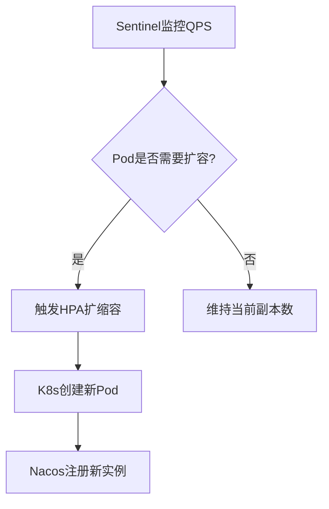
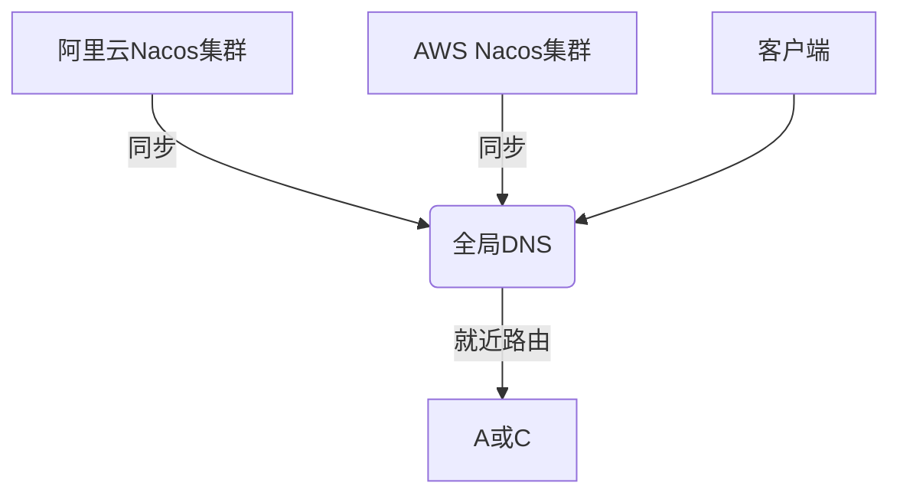
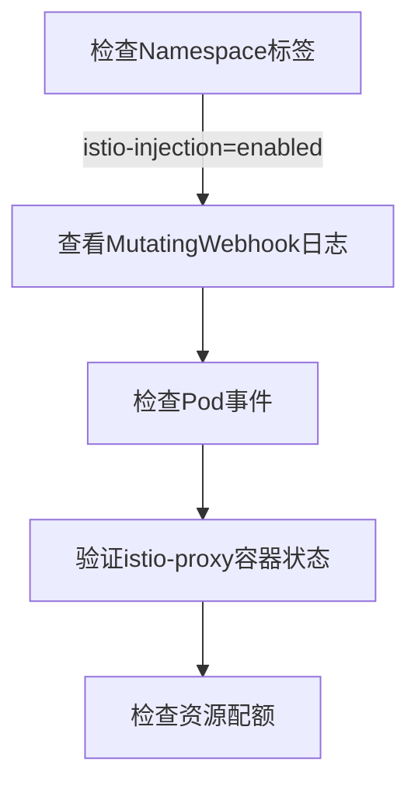

# 目录

## **1. Kubernetes与微服务集成**  

1.1 **容器化部署规范**  
• 多环境配置管理（ConfigMap与Nacos联动）  
• 健康检查探针配置（Liveness/Readiness定制策略）  
1.2 **弹性服务治理**  
• HPA自动扩缩容规则设计  
• Sentinel指标驱动弹性伸缩  

## **2. Service Mesh进阶架构**  
2.1 **Istio深度集成**  
• Sidecar自动注入与流量劫持原理  
• XID全链路透传方案（Header传播机制）  
2.2 **混合流量治理**  
• Istio VirtualService灰度路由规则  
• Sentinel熔断降级与Istio故障注入协同  

## **3. 生产级解决方案**  
3.1 **混合云服务发现**  
• Nacos多集群联邦部署模式  
• 跨云网络拓扑优化方案  
3.2 **安全合规体系**  
• mTLS双向认证配置流程  
• 基于OPA的细粒度访问控制  

## **4. 性能优化与监控**  
4.1 **基础设施调优**  
• Sidecar资源配额精细化控制  
• Envoy链路压缩与缓存策略  
4.2 **全栈监控体系**  
• Prometheus指标采集规则定义  
• 业务指标暴露与Grafana看板定制  

## **5. 故障排查与调试**  
5.1 **常见问题诊断**  
• Sidecar注入失败排查手册  
• 双注册冲突解决方案  
5.2 **高级调试工具**  
• istioctl流量镜像实战  
• ksniff网络包分析技术  

## **6. 行业落地案例**  
6.1 **金融级合规方案**  
• 跨数据中心事务一致性保障  
• 安全审计日志规范  
6.2 **电商大促架构**  
• 万级Pod秒级扩容实践  
• 网格化流量调度系统  

# **1. Kubernetes与微服务集成**

## **1.1 容器化部署规范**

### **多环境配置管理（ConfigMap与Nacos联动）**
#### **核心配置方案**

```yaml
configmap-nacos-sync.yaml
apiVersion: v1
kind: ConfigMap
metadata:
  name: app-config
data:
  application.yaml: |
    spring:
      profiles:
        active: ${ENV:dev}
      cloud:
        nacos:
          config:
            server-addr: nacos-cluster:8848
            extension-configs:
              ▪ data-id: ${spring.application.name}-${spring.profiles.active}.yaml

                refresh: true
```

**实现原理**：

1. **优先级机制**：
   - Nacos配置 > ConfigMap > Jar包内配置
2. **动态刷新**：
   ```java
   @RefreshScope
   @Value("${custom.config}")
   private String configValue; // 配置变更自动生效
   ```
3. **环境隔离**：
   ```bash
   # 开发环境
   kubectl apply -f configmap-dev.yaml
   # 生产环境 
   kubectl apply -f configmap-prod.yaml
   ```

### **健康检查探针配置**
#### **Liveness/Readiness定制策略**
```yaml
deployment-probes.yaml
livenessProbe:
  httpGet:
    path: /actuator/health/liveness
    port: 8080
  initialDelaySeconds: 30
  periodSeconds: 5
  failureThreshold: 3
  timeoutSeconds: 1

readinessProbe:
  httpGet:
    path: /actuator/health/readiness 
    port: 8080
  initialDelaySeconds: 10
  successThreshold: 2
```

**健康检查设计要点**：
1. **分级检测**：
   ```java
   // 自定义健康指标
   public Health coreServiceHealth() {
       boolean dbOk = checkDatabase();
       boolean mqOk = checkMQ();
       return new Health.Builder()
           .status(dbOk && mqOk ? UP : DOWN)
           .withDetail("db", dbOk)
           .withDetail("mq", mqOk)
           .build();
   }
   ```
2. **探针区别**：
   - Liveness：检测致命错误（触发重启）
   - Readiness：检测临时不可用（停止流量）

## **1.2 弹性服务治理**

### **HPA自动扩缩容规则设计**
#### **多维度弹性规则**
```yaml
hpa-custom-metrics.yaml
apiVersion: autoscaling/v2
kind: HorizontalPodAutoscaler
metadata:
  name: order-service-hpa
spec:
  scaleTargetRef:
    apiVersion: apps/v1
    kind: Deployment
    name: order-service
  minReplicas: 2
  maxReplicas: 10
  metrics:
  • type: Resource

    resource:
      name: cpu
      target:
        type: Utilization
        averageUtilization: 60
  • type: External

    external:
      metric:
        name: http_requests_per_second
        selector:
          matchLabels:
            app: order-service
      target:
        type: AverageValue 
        averageValue: 500
```

**关键配置说明**：
1. **冷却时间控制**：
   ```bash
   kubectl patch hpa order-service-hpa -p '{"spec":{"behavior":{"scaleDown":{"stabilizationWindowSeconds":300}}}}'
   ```
2. **自定义指标采集**：
   ```java
   @Bean
   MeterRegistryCustomizer<MeterRegistry> metrics() {
       return registry -> registry.config().commonTags("app", "order-service");
   }
   ```

### **Sentinel指标驱动弹性伸缩**
#### **QPS监控与自动扩缩**
```java
// Sentinel指标暴露
@PostConstruct
public void initSentinelMetrics() {
    List<FlowRule> rules = FlowRuleManager.getRules();
    rules.forEach(rule -> {
        Gauge.builder("sentinel.flow.qps", 
                () -> ClusterNodeStatistics.getNode(rule.getResource()).totalQps())
            .tag("resource", rule.getResource())
            .register(meterRegistry);
    });
}
```

**弹性策略流程**：


生产建议：
1. 缓冲阈值：实际流量达到阈值的80%时提前扩容
2. 缩容保护：至少保留2个Pod防止雪崩
3. 指标聚合：采用5分钟滑动窗口平均值

# **2. Service Mesh进阶架构**

## **2.1 Istio深度集成**

### **Sidecar自动注入与流量劫持原理**
#### **自动注入配置**

```markdown
```yaml
namespace-label.yaml
apiVersion: v1
kind: Namespace
metadata:
  name: microservices
  labels:
    istio-injection: enabled  # 开启自动注入

pod-annotations.yaml
annotations:
  proxy.istio.io/config: |
    tracing:
      sampling: 100%  # 全量采集
    holdApplicationUntilProxyStarts: true  # 等待Sidecar就绪
```

**流量劫持机制**：
1. **iptables规则**：
   ```bash
   # 查看Pod内的iptables规则
   $ kubectl exec -it product-service-xxxx -c istio-proxy -- iptables -t nat -L
   Chain ISTIO_INBOUND (1 references)
   target     prot opt source    destination
   ISTIO_IN_REDIRECT  tcp  --  anywhere  anywhere  tcp dpt:8080
   ```
2. **透明代理流程**：
   ```mermaid
   graph LR
   A[App] -->|8080| B(Istio iptables)
   B -->|15006| C(Envoy)
   C -->|8080| D[Upstream]
   ```

### **XID全链路透传方案**
#### **Header传播配置**
```java
// Istio Header拦截器
public class IstioXidInterceptor implements ClientHttpRequestInterceptor {
    @Override
    public ClientHttpResponse intercept(HttpRequest request, byte[] body, 
            ClientHttpRequestExecution execution) throws IOException {
        // 复用Istio的x-request-id传递XID
        request.getHeaders().add("x-request-id", RootContext.getXID());  
        return execution.execute(request, body);
    }
}

// Envoy配置补丁
envoyFilters:
• applyTo: HTTP_FILTER

  match:
    context: SIDECAR_INBOUND
  patch:
    operation: INSERT_BEFORE
    value:
      name: xid-header-filter
      config:
        xidHeader: "x-request-id"
```

## **2.2 混合流量治理**

### **Istio灰度路由规则**
#### **VirtualService配置**
```yaml
apiVersion: networking.istio.io/v1alpha3
kind: VirtualService
metadata:
  name: payment-vs
spec:
  hosts:
  • payment-service

  http:
  • route:

    ◦ destination:

        host: payment-service
        subset: v1
      weight: 90
    ◦ destination:

        host: payment-service
        subset: v2
      weight: 10
    mirror:
      host: payment-service
      subset: v3  # 将10%流量镜像到v3但不返回响应
```

### **Sentinel与Istio熔断协同**
#### **熔断策略互补设计**
```java
// 网关级熔断规则
@Bean
public void initGatewayRules() {
    // Istio负责流量分配
    // Sentinel负责突发流量控制
    GatewayRuleManager.loadRules(Collections.singletonList(
        new GatewayFlowRule("payment_api")
            .setResourceMode(SentinelGatewayConstants.RESOURCE_MODE_CUSTOM_API_NAME)
            .setCount(1000)  # QPS阈值
            .setIntervalSec(1)
            .setBurst(200)   # 突发流量容忍
    ));
}
```

# **3. 生产级解决方案**

## **3.1 混合云服务发现**

### **Nacos多集群联邦**
#### **跨云部署架构**


#### **关键配置**
```properties
nacos-cluster.conf
阿里云节点
192.168.1.101:8848
AWS节点
54.238.1.102:8848

bootstrap.properties
spring.cloud.nacos.discovery.cluster-name=aws-us-east-1
spring.cloud.nacos.config.export=true  # 开启配置同步
```

## **3.2 安全合规体系**

### **mTLS双向认证**
#### **Istio PeerAuthentication**
```yaml
apiVersion: security.istio.io/v1beta1
kind: PeerAuthentication
metadata:
  name: default
spec:
  mtls:
    mode: STRICT  # 强制双向TLS
  selector:
    matchLabels:
      app: payment-service
```

### **OPA策略示例**
```rego
opa-policy.rego
package http.authz

default allow = false

allow {
    input.method == "GET"
    input.path =="/api/public"
}

allow {
    input.method == "POST"
    input.path == "/api/orders"
    token.payload.role == "admin"  # JWT鉴权
}
```

安全控制矩阵：
| 安全层 | 技术实现   | 防护目标           |
| ------ | ---------- | ------------------ |
| 传输层 | Istio mTLS | 链路加密与身份认证 |
| 应用层 | OPA+JWT    | 接口级权限控制     |
| 数据层 | Vault加密  | 敏感配置保护       |

# **4. 性能优化与监控**

## **4.1 基础设施调优**

### **Sidecar资源配额控制**
#### **精细化资源分配方案**

```yaml
envoy-sidecar-resources.yaml
resources:
  requests:
    cpu: "200m"
    memory: "256Mi"
  limits:
    cpu: "500m" 
    memory: "512Mi"
  # 特殊场景配置
  annotations:
    proxy.istio.io/config: |
      concurrency: 2  # 工作线程数
      componentLogLevel: "filter:trace"  # 调试级日志
```

**优化建议**：
1. **CPU绑定**：对延迟敏感型服务启用CPU亲和性
   ```yaml
   affinity:
     nodeAffinity:
       requiredDuringSchedulingIgnoredDuringExecution:
         nodeSelectorTerms:
         ▪ matchExpressions:
   
           ▪ key: app
   
             operator: In
             values: ["latency-sensitive"]
   ```
2. **内存优化**：调整JVM与Envoy内存比例
   ```bash
   # JVM内存配置（需预留空间给Sidecar）
   JAVA_TOOL_OPTIONS="-Xms512m -Xmx512m -XX:MaxRAMPercentage=75.0"
   ```

### **Envoy高级调优**
#### **链路压缩配置**
```yaml
envoy-compression.yaml
apiVersion: networking.istio.io/v1alpha3
kind: EnvoyFilter
metadata:
  name: gzip-filter
spec:
  configPatches:
  • applyTo: HTTP_FILTER

    patch:
      operation: INSERT_BEFORE
      value:
        name: envoy.filters.http.gzip
        typed_config:
          "@type": type.googleapis.com/envoy.extensions.filters.http.gzip.v3.Gzip
          memory_level: 3  # 内存使用级别(1-9)
          compression_level: BEST_COMPRESSION
          content_type: ["application/json","text/plain"]
```

#### **缓存策略示例**
```yaml
envoy-cache.yaml
apiVersion: networking.istio.io/v1alpha3
kind: EnvoyFilter
metadata:
  name: http-cache
spec:
  configPatches:
  • applyTo: HTTP_FILTER

    patch:
      operation: INSERT_BEFORE
      value:
        name: envoy.filters.http.cache
        typed_config:
          "@type": type.googleapis.com/envoy.extensions.filters.http.cache.v3.CacheConfig
          typed_config:
            "@type": type.googleapis.com/envoy.extensions.http.cache.simple_http_cache.v3.SimpleHttpCacheConfig
```

## **4.2 全栈监控体系**

### **Prometheus指标采集**
#### **自定义采集规则**
```yaml
prometheus-custom.yaml
scrape_configs:
• job_name: 'istio_sidecars'

  metrics_path: /stats/prometheus
  kubernetes_sd_configs:
  • role: pod

    namespaces:
      names: ["production"]
  relabel_configs:
  • source_labels: [__meta_kubernetes_pod_annotation_prometheus_io_scrape]

    action: keep
    regex: true
  metric_relabel_configs:
  • source_labels: [__name__]

    regex: '(istio_.*|envoy_.*)'
    action: keep
```

#### **业务指标暴露**
```java
// 订单服务自定义指标
@RestController
public class OrderMetricsController {
    
    private final Counter orderCounter = Counter.build()
        .name("orders_created_total")
        .help("Total created orders")
        .labelNames("status")
        .register();

    @PostMapping("/orders")
    public Order createOrder() {
        try {
            Order order = orderService.create();
            orderCounter.labels("success").inc();
            return order;
        } catch (Exception e) {
            orderCounter.labels("fail").inc();
            throw e;
        }
    }
}
```

### **Grafana看板定制**
#### **关键监控指标**
| 指标类型    | PromQL表达式                                                 | 告警阈值      |
| ----------- | ------------------------------------------------------------ | ------------- |
| 服务成功率  | sum(rate(http_requests_total{status!~"5.."}[1m])) / sum(rate(http_requests_total[1m])) | <99.9%        |
| 链路延迟    | histogram_quantile(0.95, sum(rate(istio_request_duration_milliseconds_bucket[1m])) by (le)) | >500ms        |
| Sidecar内存 | container_memory_working_set_bytes{container="istio-proxy"}  | >80% of limit |

# **5. 故障排查与调试**

## **5.1 常见问题诊断**

### **Sidecar注入失败排查**
#### **诊断流程**


#### **典型错误处理**
```bash
查看webhook日志
kubectl logs -n istio-system $(kubectl get pod -n istio-system -l app=sidecar-injector -o jsonpath='{.items[0].metadata.name}')

检查准入控制器
kubectl get validatingwebhookconfiguration,mutatingwebhookconfiguration

强制注入Sidecar
kubectl patch deployment/my-app -p '{"spec":{"template":{"metadata":{"annotations":{"sidecar.istio.io/inject":"true"}}}}}'
```

### **双注册问题解决**
#### **Nacos与K8s服务发现冲突**
```yaml
application.properties解决方案
spring.cloud.nacos.discovery.register-enabled=false  # 禁用Nacos注册
spring.cloud.kubernetes.discovery.primary-port-name=http # 指定K8s主端口
```

#### **服务网格层解决方案**
```yaml
istio-serviceentry.yaml
apiVersion: networking.istio.io/v1alpha3
kind: ServiceEntry
metadata:
  name: external-nacos
spec:
  hosts:
  • nacos-cluster.default.svc.cluster.local

  ports:
  • number: 8848

    name: http
    protocol: HTTP
  resolution: DNS
```

## **5.2 高级调试工具**

### **istioctl流量镜像**
```bash
实时流量镜像到新版本
istioctl experimental dashboard envoy product-service-xxxx --address 0.0.0.0 --config_dump | grep -A10 "route mirror"

创建调试会话
istioctl experimental authz check <pod> -v 6 --headers "x-debug: true"
```

### **ksniff网络包分析**
```bash
抓取指定Pod的HTTP流量
kubectl sniff product-service-xxxx -n default -f "tcp port 8080" -o ./capture.pcap

实时分析MySQL查询
kubectl sniff db-pod -p -f "port 3306" | tshark -i - -Y "mysql.query"
```

---

# **6. 行业落地案例**

## **6.1 金融级合规方案**

### **跨数据中心事务一致性保障**
#### **Seata集群多活部署**

```yaml
seata-server-cluster.yaml
apiVersion: apps/v1
kind: StatefulSet
metadata:
  name: seata-server
spec:
  serviceName: "seata"
  replicas: 3
  template:
    spec:
      containers:
      ◦ name: seata

        env:
        ▪ name: SEATA_IP

          valueFrom:
            fieldRef:
              fieldPath: status.podIP
        ▪ name: SEATA_CONFIG_FILE

          value: "file:/root/seata-config/registry.conf"
        volumeMounts:
        ▪ name: seata-config

          mountPath: /root/seata-config
  volumeClaimTemplates:
  • metadata:

      name: seata-config
    spec:
      storageClassName: csi-rbd-sc
      accessModes: [ "ReadWriteOnce" ]
      resources:
        requests:
          storage: 10Gi
```

**关键设计**：
1. **数据同步机制**：
   
   ```sql
   -- 全局事务表结构优化
   CREATE TABLE global_table (
     xid VARCHAR(128) NOT NULL PRIMARY KEY,
     status TINYINT NOT NULL,
     gmt_create DATETIME(6) NOT NULL,
     gmt_modified DATETIME(6) NOT NULL,
     INDEX idx_gmt_modified (gmt_modified)
   ) ENGINE=InnoDB DEFAULT CHARSET=utf8mb4 ROW_FORMAT=COMPRESSED;
   ```
2. **异地容灾策略**：
   ```mermaid
   graph TD
       A[北京中心] -->|半同步复制| B[上海灾备]
       A -->|异步复制| C[广州灾备]
       B --> D[自动切换VIP]
   ```

### **安全审计日志规范**
#### **日志采集方案**
```java
// 审计日志切面
@Aspect
@Component
public class AuditLogAspect {
    
    @Autowired
    private KafkaTemplate<String, String> kafkaTemplate;

    @AfterReturning("execution(* com.bank..service.*.*(..))")
    public void auditLog(JoinPoint joinPoint) {
        AuditLog log = AuditLog.builder()
            .userId(SecurityContext.getUser())
            .action(joinPoint.getSignature().getName())
            .timestamp(System.currentTimeMillis())
            .build();
        kafkaTemplate.send("audit-log", JSON.toJSONString(log));
    }
}
```

**审计体系要求**：
| 维度       | 实现方案    | 合规标准        |
| ---------- | ----------- | --------------- |
| 完整性     | 区块链存证  | PCI DSS 3.2.1   |
| 不可篡改性 | HSM签名     | GDPR Article 30 |
| 可追溯性   | 关联TraceID | SOX 404         |

## **6.2 电商大促架构**

### **万级Pod秒级扩容**
#### **弹性扩缩容方案**
```yaml
hpa-special.yaml
apiVersion: autoscaling/v2beta2
kind: HorizontalPodAutoscaler
metadata:
  name: flash-sale-hpa
  annotations:
    scaler.aliyun.com/max: "10000"  # 阿里云弹性增强
spec:
  scaleTargetRef:
    apiVersion: apps/v1
    kind: Deployment
    name: flash-sale-service
  minReplicas: 100
  maxReplicas: 10000
  metrics:
  • type: External

    external:
      metric:
        name: sls_metric
        selector:
          matchLabels:
            app: flash-sale
      target:
        type: AverageValue
        averageValue: 1000  # 每Pod承载1000QPS
```

**关键技术**：
1. **镜像预热**：
   ```bash
   # 批量预热Node节点
   for node in $(kubectl get nodes -o name); do
     kubectl debug node/${node#node/} -it --image=busybox -- \
       ctr -n k8s.io images pull registry.cn-hangzhou.aliyuncs.com/ns/flash-sale:v1
   done
   ```
2. **资源池化**：
   ```mermaid
   graph LR
       A[弹性资源池] -->|突发扩容| B[常规资源池]
       A -->|缩容回收| C[Spot实例池]
   ```

### **网格化流量调度**
#### **多级流量管控**
```yaml
traffic-layers.yaml
apiVersion: networking.istio.io/v1alpha3
kind: VirtualService
metadata:
  name: traffic-control
spec:
  hosts:
  • "*.mall.com"

  http:
  • match:

    ◦ headers:

        x-user-tier:
          exact: platinum
    route:
    ◦ destination:

        host: vip-service
  • match:

    ◦ queryParams:

        promo:
          exact: flashsale
    fault:
      abort:
        percentage:
          value: 90.0
        httpStatus: 429
    route:
    ◦ destination:

        host: queue-service
```

流量调度矩阵：
| 流量类型    | 调度策略      | 目标服务     |
| ----------- | ------------- | ------------ |
| 普通流量    | 轮询负载均衡  | 常规服务组   |
| 大促流量    | 队列削峰+熔断 | 弹性服务组   |
| VIP用户流量 | 专属链路      | 高可用服务组 |

