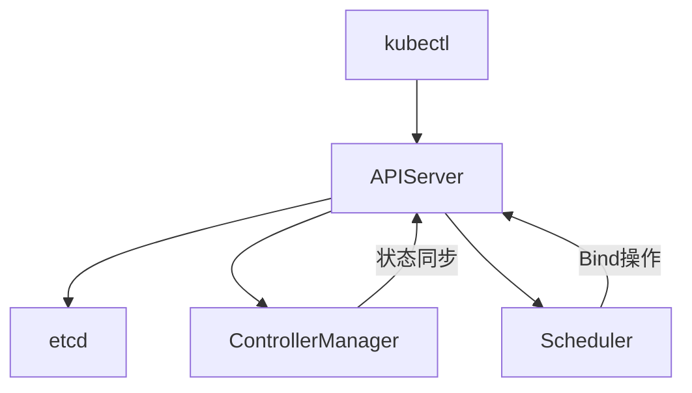
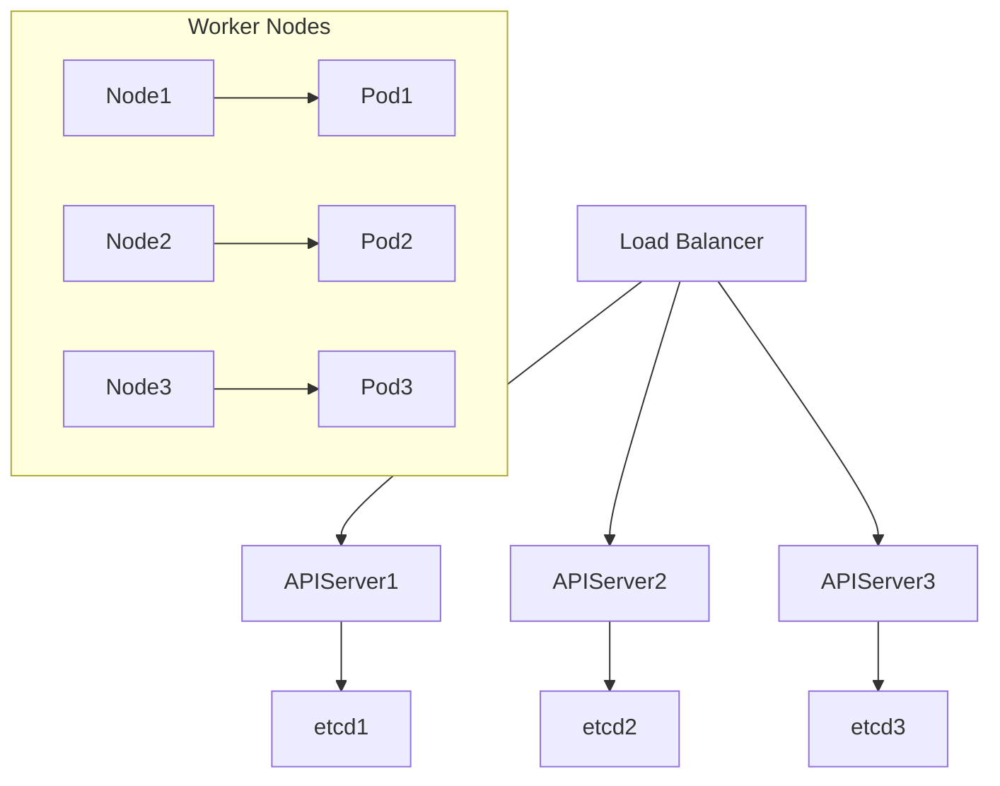

# 目录

## **一、Kubernetes核心原理深度解析**  
1. **架构设计精髓**  
   • 控制平面组件（API Server、etcd、Controller Manager、Scheduler）协作流程  
   • 数据平面（kubelet、容器运行时、CNI/CSI插件）核心工作机制  
2. **API对象与声明式模型**  
   • CRD（Custom Resource Definition）扩展机制与Operator设计思想  
   • Informer机制与List-Watch实现原理（源码级解析）  
3. **调度器进阶**  
   • 调度算法扩展：亲和性/反亲和性、污点与容忍、拓扑分布约束  
   • 自定义调度器开发（Scheduler Extender）  

---

## **二、高级工作负载管理**  
1. **StatefulSet与有状态服务**  
   • 拓扑约束与持久化存储（PVC动态供给实战）  
   • 有状态服务滚动更新策略（Partitioned Update）  
2. **DaemonSet与节点级服务**  
   • 节点污点与Pod容忍配置（GPU节点专属调度）  
   • 日志收集实战：Fluentd+Elasticsearch多租户隔离  
3. **Job与CronJob批处理**  
   • 并行任务控制（Parallelism/Completions）  
   • 任务超时与重试策略（BackoffLimit）  

---

## **三、网络与存储进阶**  
1. **CNI插件深度实践**  
   • Calico BGP网络模型与IPAM优化  
   • Cilium eBPF实现网络策略（替代kube-proxy）  
2. **服务暴露与Ingress控制**  
   • Ingress Controller选型（Nginx vs Traefik vs Envoy）  
   • 金丝雀发布实战：Header路由+流量镜像（Istio集成）  
3. **存储架构优化**  
   • CSI插件开发：对接云厂商块存储（AWS EBS/AliCloud Disk）  
   • 本地存储管理（Local Persistent Volume）与调度策略  

---

## **四、安全加固与权限管理**  
1. **RBAC与安全策略**  
   • 最小权限原则实战：Role/ClusterRole设计规范  
   • ServiceAccount权限隔离（Pod绑定自定义SA）  
2. **网络策略（NetworkPolicy）**  
   • 零信任网络模型：命名空间隔离+Pod级防火墙规则  
   • 跨命名空间通信策略（允许特定Label的Pod互通）  
3. **密钥与敏感数据管理**  
   • SealedSecret加密方案（公钥加密+集群内解密）  
   • Vault集成：动态数据库凭据发放与自动轮转  

---

## **五、Operator开发与扩展**  
1. **Operator Framework核心组件**  
   • Kubebuilder开发框架（Controller Runtime库）  
   • Reconciler事件驱动模型（Create/Update/Delete事件处理）  
2. **自定义控制器实战**  
   • 案例：自动化MySQL主从集群（状态检测+故障转移）  
3. **Webhook开发**  
   • 准入控制（Mutating/Validating Webhook）实现资源校验  
   • 案例：强制Pod资源限制（拒绝无Limits的Pod创建）  

---

## **六、性能调优与监控**  
1. **集群性能瓶颈分析**  
   • API Server优化：请求限流（--max-requests-inflight）  
   • etcd存储压缩与碎片整理（etcdctl defrag）  
2. **资源管理与调度优化**  
   • 资源配额（ResourceQuota）与LimitRange配置规范  
   • 节点压力驱逐策略（Eviction Manager）与优雅驱逐  
3. **可观测性体系构建**  
   • Prometheus Operator自动监控（ServiceMonitor/PodMonitor）  
   • 日志采集架构：Loki+Grafana替代传统ELK  

---

## **七、多集群与混合云管理**  
1. **集群联邦（Karmada/Clusternet）**  
   • 多集群应用分发策略（权重/故障转移）  
   • 跨集群服务发现（Submariner实现Pod IP互通）  
2. **混合云部署模式**  
   • 案例：核心业务部署在IDC（本地集群），弹性业务部署在公有云（ACK/TKE）  
   • 统一监控方案（Thanos跨集群查询）  
3. **GitOps多环境管理**  
   • ArgoCD ApplicationSet实现多集群同步  
   • 环境差异化配置（Kustomize Overlay）  

---

## **八、生产级故障排查与调优**  
1. **常见故障场景**  
   • Pod启动失败：ImagePullBackOff/ContainerCreating状态诊断  
   • 网络连通性：iptables规则分析与Calico日志解读  
2. **调试工具链**  
   • kubectl debug调试容器（临时注入诊断工具）  
   • eBPF工具链（kubectl-trace/BCC）实时追踪系统调用  
3. **调优案例解析**  
   • 案例1：API Server OOM问题（增大--default-not-ready-toleration-seconds）  
   • 案例2：大规模集群etcd性能优化（SSD磁盘+心跳参数调整）  

---

## **九、面试高频题与架构设计**  
1. **经典面试题解析**  
   • 如何设计一个高可用Kubernetes集群？  
   • 如何优化大规模集群的调度性能？  
2. **架构设计挑战**  
   • 设计一个支持万节点的Kubernetes集群（etcd分片/API Server水平扩展）  
   • 跨云灾备方案：主集群故障时秒级切换至备用集群  
3. **前沿技术探讨**  
   • Serverless容器（Knative vs AWS Fargate）  
   • 边缘计算场景下的Kubernetes轻量化方案（K3s/KubeEdge）  

---

## **附录：工具链与资源**  
1. **开发工具包**  
   • k9s集群管理工具、kubectl插件（krew）  
   • Lens IDE图形化集群管理  
2. **开源项目推荐**  
   • 集群生命周期管理：kubeadm/kops  
   • 策略管理：Kyverno/OPA Gatekeeper  
3. **学习路径推荐**  
   • CKAD/CKA认证备考指南  
   • Kubernetes源码精读（client-go/informer）  

---

---

# **一、Kubernetes核心原理深度解析**  

---

## **1. 架构设计精髓**  

#### **控制平面组件协作流程**  
Kubernetes的控制平面由四大核心组件构成，其协作流程如下：  

1. **API Server**  
   • **功能**：所有集群操作的唯一入口，提供RESTful API，负责认证、鉴权、请求路由及数据持久化。  
   • **关键流程**：  
     ```bash  
     # 用户请求示例：创建Pod  
     kubectl apply -f pod.yaml → API Server → 认证 → 鉴权 → 准入控制 → etcd存储  
     ```
   • **性能优化**：通过`--max-requests-inflight`限制并发请求，防止过载。  

2. **etcd**  
   • **数据结构**：键值存储，所有资源对象以`/registry/<资源类型>/<命名空间>/<对象名>`格式存储。  
   • **一致性保障**：Raft协议确保数据强一致性，建议部署奇数节点（3/5节点）。  
   • **监控指标**：`etcd_server_leader_changes_seen_total`（Leader切换次数）反映集群稳定性。  

3. **Controller Manager**  
   • **核心控制器**：  
     ◦ **Deployment Controller**：监听ReplicaSet状态，确保副本数符合预期。  
     ◦ **Node Controller**：监控节点心跳，触发Pod驱逐（NoExecute污点）。  
   • **工作模式**：多协程并发执行，通过`--concurrent-deployment-syncs`控制同步并发数。  

4. **Scheduler**  
   • **调度周期**：  
     ◦ **预选（Predicate）**：过滤不满足条件的节点（如资源不足）。  
     ◦ **优选（Priority）**：对节点打分（如资源剩余量、亲和性）。  
   • **调度队列**：优先级队列（PriorityQueue）处理待调度Pod，支持抢占（Preemption）。  

**协作流程图**：  


---

#### **数据平面核心工作机制**  
数据平面负责运行容器化应用，核心组件包括：  

1. **kubelet**  
   • **核心职责**：  
     ◦ 管理Pod生命周期（创建/销毁容器）。  
     ◦ 上报节点状态（CPU/内存/磁盘）至API Server。  
   • **关键机制**：  
     ◦ **PLEG（Pod Lifecycle Event Generator）**：通过`runtime.State`检查容器状态变化。  
     ◦ **Eviction Manager**：根据节点压力（内存/磁盘不足）驱逐低优先级Pod。  

2. **容器运行时（Container Runtime）**  
   • **主流实现**：  
     ◦ **containerd**：默认运行时，通过CRI（Container Runtime Interface）与kubelet交互。  
     ◦ **CRI-O**：专为Kubernetes设计的轻量级运行时。  
   • **工作流程**：  
     ```mermaid  
     graph LR  
         kubelet --CRI gRPC调用--> runtime  
         runtime -->|创建容器| OCI(OCI兼容运行时如runc)  
     ```

3. **CNI插件**  
   • **核心功能**：  
     ◦ Pod网络配置（IP分配、路由规则）。  
     ◦ 多网络方案支持（如Calico BGP、Cilium eBPF）。  
   • **调用链**：  
     ```bash  
     kubelet → 调用CNI插件 → 配置veth pair → 挂载容器网络命名空间  
     ```

4. **CSI插件**  
   • **核心流程**：  
     ◦ **Attach**：将云盘挂载到节点（如AWS EBS卷挂载到EC2）。  
     ◦ **Mount**：将卷挂载到Pod路径（如`/var/lib/kubelet/pods/<pod-id>/volumes`）。  
   • **示例**：  
     ```yaml  
     apiVersion: storage.k8s.io/v1  
     kind: StorageClass  
     metadata:  
       name: ebs-sc  
     provisioner: ebs.csi.aws.com  
     parameters:  
       type: gp3  
     ```

---

## **2. API对象与声明式模型**  

#### **CRD与Operator设计思想**  
1. **CRD扩展机制**  
   • **定义示例**：  
     ```yaml  
     apiVersion: apiextensions.k8s.io/v1  
     kind: CustomResourceDefinition  
     metadata:  
       name: mysqlclusters.database.example.com  
     spec:  
       group: database.example.com  
       versions:  
         - name: v1alpha1  
       scope: Namespaced  
       names:  
         plural: mysqlclusters  
         singular: mysqlcluster  
         kind: MySQLCluster  
     ```
   • **使用场景**：定义自定义资源（如MySQLCluster），Operator监听该资源并执行运维操作。  

2. **Operator设计模式**  
   • **核心组件**：  
     ◦ **Reconciler**：持续调谐实际状态与期望状态（如自动修复故障Pod）。  
     ◦ **Informer**：监听API对象变化，减少API Server负载。  
   • **开发框架**：  
     ◦ **Kubebuilder**：  
       ```bash  
       kubebuilder init --domain example.com  
       kubebuilder create api --group database --version v1alpha1 --kind MySQLCluster  
       ```  

#### **Informer机制与List-Watch实现**  
1. **List-Watch原理**  
   • **List**：首次全量同步资源（通过`GET /api/v1/pods`）。  
   • **Watch**：通过长连接（HTTP Chunked）监听增量事件（ADDED/MODIFIED/DELETED）。  
   • **Resync机制**：定时全量同步（默认10分钟），防止事件丢失。  

2. **Informer工作流程**  
   ```go  
   // 伪代码示例  
   func (informer *SharedInformer) Run(stopCh <-chan struct{}) {  
       // 1. 初始化缓存  
       list, _ := kubeClient.List(api.ListOptions{})  
       cache.Replace(list.Items)  
   
       // 2. 启动Reflector监听变化  
       reflector := NewReflector(kubeClient, &api.Pod{}, resyncPeriod)  
       reflector.Run(stopCh)  
   
       // 3. 处理事件  
       for event := range reflector.ResultChan() {  
           switch event.Type {  
           case Added:  
               cache.Add(event.Object)  
           case Updated:  
               cache.Update(event.Object)  
           case Deleted:  
               cache.Delete(event.Object)  
           }  
       }  
   }  
   ```

3. **性能优化**：  
   • **Delta FIFO队列**：合并连续MODIFIED事件，减少处理开销。  
   • **分片处理**：大型集群按命名空间分片（如1个Informer处理10个Namespace）。  

---

## **3. 调度器进阶**  

#### **调度算法扩展**  
1. **亲和性/反亲和性（Affinity/Anti-Affinity）**  
   • **Pod亲和性**：  
     ```yaml  
     affinity:  
       podAffinity:  
         requiredDuringSchedulingIgnoredDuringExecution:  
         - labelSelector:  
             matchLabels:  
               app: cache  
           topologyKey: kubernetes.io/hostname  
     ```
   • **应用场景**：将同一服务的多个Pod分散在不同节点（反亲和性）。  

2. **污点（Taint）与容忍（Toleration）**  
   • **节点污点**：  
     ```bash  
     kubectl taint nodes node1 key=value:NoSchedule  
     ```
   • **Pod容忍**：  
     ```yaml  
     tolerations:  
     - key: "key"  
       operator: "Equal"  
       value: "value"  
       effect: "NoSchedule"  
     ```

3. **拓扑分布约束（Topology Spread Constraints）**  
   • **配置示例**：  
     ```yaml  
     topologySpreadConstraints:  
     - maxSkew: 1  
       topologyKey: zone  
       whenUnsatisfiable: ScheduleAnyway  
     ```
   • **效果**：确保Pod均匀分布在不同的可用区（zone）。  

#### **自定义调度器开发**  
1. **Scheduler Extender模式**  
   • **工作流程**：  
     1. 主调度器完成预选/优选后，通过HTTP调用Extender。  
     2. Extender返回过滤/打分结果，主调度器合并结果。  
   • **配置示例**：  
     ```json  
     {  
       "kind": "Policy",  
       "extenders": [{  
         "urlPrefix": "http://extender-service:80/scheduler",  
         "filterVerb": "filter"  
       }]  
     }  
     ```

2. **完全自定义调度器**  
   • **核心步骤**：  
     1. 实现`k8s.io/kubernetes/pkg/scheduler/framework`接口。  
     2. 注册插件：  
     ```go  
     func NewCustomScheduler() framework.Plugin {  
         return &CustomScheduler{}  
     }  
     ```
   • **案例**：基于AI模型的智能调度器（预测资源需求）。  

---

## **总结**  
本节深入解析了Kubernetes控制平面与数据平面的协作机制、API对象的声明式管理模型，以及调度器的扩展能力。通过源码级原理剖析（如List-Watch实现）和实战配置示例（如CRD定义、调度策略），读者可掌握Kubernetes核心组件的内部工作原理，为后续高阶实践（如Operator开发、多集群管理）奠定坚实基础。

---

# **二、高级工作负载管理**  

---

## **1. StatefulSet与有状态服务**  

#### **拓扑约束与持久化存储**  
StatefulSet 是 Kubernetes 中管理有状态应用的核心资源，适用于需要稳定网络标识和持久化存储的场景（如 MySQL 集群、Redis 哨兵模式）。  

1. **Pod 标识与网络稳定性**  
   • **唯一标识**：每个 Pod 拥有固定名称（如 `mysql-0`、`mysql-1`），重启或重新调度后保持不变。  
   • **DNS 解析**：通过 Headless Service（无头服务）提供稳定的 DNS 记录：  
     ```yaml  
     apiVersion: v1  
     kind: Service  
     metadata:  
       name: mysql  
     spec:  
       clusterIP: None  # Headless Service  
       selector:  
         app: mysql  
     ```
     Pod 的 DNS 格式为：`<pod-name>.<service-name>.<namespace>.svc.cluster.local`（如 `mysql-0.mysql.default.svc.cluster.local`）。  

2. **动态持久化存储（PVC 模板）**  
   • **VolumeClaimTemplates**：为每个 Pod 自动创建 PVC，确保数据独立存储。  
     ```yaml  
     apiVersion: apps/v1  
     kind: StatefulSet  
     metadata:  
       name: mysql  
     spec:  
       serviceName: "mysql"  
       replicas: 3  
       template:  
         metadata:  
           labels:  
             app: mysql  
         spec:  
           containers:  
           - name: mysql  
             volumeMounts:  
             - name: data  
               mountPath: /var/lib/mysql  
       volumeClaimTemplates:  
       - metadata:  
           name: data  
         spec:  
           storageClassName: "ebs-gp3"  
           accessModes: [ "ReadWriteOnce" ]  
           resources:  
             requests:  
               storage: 100Gi  
     ```
   • **存储类（StorageClass）**：动态分配云存储（如 AWS EBS、阿里云盘）。  

3. **滚动更新策略（Partitioned Update）**  
   • **分区更新**：通过 `partition` 参数控制更新范围，逐步验证新版本稳定性。  
     ```yaml  
     updateStrategy:  
       type: RollingUpdate  
       rollingUpdate:  
         partition: 1  # 仅更新序号≥1的Pod（保留mysql-0作为旧版本）  
     ```
   • **验证流程**：  
     1. 更新 `mysql-1` 和 `mysql-2`，观察服务状态。  
     2. 若验证通过，将 `partition` 设为 0，更新 `mysql-0`。  

---

## **2. DaemonSet与节点级服务**  

#### **节点污点与GPU节点专属调度**  
DaemonSet 确保每个节点（或符合条件的节点）运行一个 Pod 副本，适用于系统级服务（如日志收集、网络插件）。  

1. **污点与容忍配置**  
   • **节点打污点**：标记 GPU 节点。  
     ```bash  
     kubectl taint nodes gpu-node-1 hardware-type=gpu:NoSchedule  
     ```
   • **DaemonSet 容忍配置**：  
     ```yaml  
     tolerations:  
     - key: "hardware-type"  
       operator: "Equal"  
       value: "gpu"  
       effect: "NoSchedule"  
     ```

2. **日志收集实战（Fluentd + Elasticsearch）**  
   • **Fluentd DaemonSet 配置**：  
     ```yaml  
     apiVersion: apps/v1  
     kind: DaemonSet  
     metadata:  
       name: fluentd  
     spec:  
       selector:  
         matchLabels:  
           name: fluentd  
       template:  
         metadata:  
           labels:  
             name: fluentd  
         spec:  
           tolerations:  
           - operator: "Exists"  # 容忍所有污点  
           containers:  
           - name: fluentd  
             image: fluent/fluentd-kubernetes-daemonset:v1.14.3-debian-elasticsearch7-1.0  
             env:  
               - name: FLUENT_ELASTICSEARCH_HOST  
                 value: "elasticsearch-logging"  
               - name: FLUENT_ELASTICSEARCH_PORT  
                 value: "9200"  
             volumeMounts:  
               - name: varlog  
                 mountPath: /var/log  
               - name: dockercontainers  
                 mountPath: /var/lib/docker/containers  
           volumes:  
             - name: varlog  
               hostPath:  
                 path: /var/log  
             - name: dockercontainers  
               hostPath:  
                 path: /var/lib/docker/containers  
     ```
   • **多租户隔离**：  
     ◦ **按命名空间隔离**：Elasticsearch 为每个 Kubernetes 命名空间创建独立索引（如 `logs-dev-2023.08.01`）。  
     ◦ **RBAC 控制**：通过 Elasticsearch 角色限制租户访问权限。  

---

## **3. Job与CronJob批处理**  

#### **并行任务控制与超时策略**  
Job 用于运行一次性任务（如数据处理），CronJob 用于定时任务（如每日报表生成）。  

1. **并行任务配置**  
   • **参数解析**：  
     ◦ `completions`：需成功完成的 Pod 总数。  
     ◦ `parallelism`：同时运行的 Pod 数。  
   • **示例**：并行处理 100 个数据分片。  
     ```yaml  
     apiVersion: batch/v1  
     kind: Job  
     metadata:  
       name: data-processor  
     spec:  
       completions: 100  
       parallelism: 10  
       template:  
         spec:  
           containers:  
           - name: processor  
             image: data-processor:v1.2  
             args: ["--shard-index=$(JOB_COMPLETION_INDEX)"]  
           restartPolicy: OnFailure  
     ```

2. **任务超时与重试策略**  
   • **超时设置**：通过 `activeDeadlineSeconds` 限制任务最大运行时间。  
     ```yaml  
     spec:  
       activeDeadlineSeconds: 3600  # 1小时后超时  
     ```
   • **重试机制**：`backoffLimit` 控制失败重试次数（默认 6 次）。  
     ```yaml  
     spec:  
       backoffLimit: 3  
     ```

3. **CronJob定时任务**  
   • **Cron表达式**：  
     ```yaml  
     apiVersion: batch/v1beta1  
     kind: CronJob  
     spec:  
       schedule: "0 3 * * *"  # 每天凌晨3点执行  
       jobTemplate:  
         spec:  
           template:  
             spec:  
               containers:  
               - name: report-generator  
                 image: report-gen:v2.1  
     ```
   • **历史记录保留**：通过 `successfulJobsHistoryLimit` 和 `failedJobsHistoryLimit` 控制保留的 Job 数量。  

---

## **总结**  
本节深入剖析了 Kubernetes 高级工作负载的核心管理机制：  
• **StatefulSet** 通过稳定标识和持久化存储支撑有状态服务。  
• **DaemonSet** 确保节点级任务的高效调度与运行。  
• **Job/CronJob** 为批处理和定时任务提供灵活控制能力。  
通过配置示例与实战场景（如 GPU 节点调度、日志收集隔离），读者可掌握生产环境中复杂工作负载的管理技巧，构建高可用、可扩展的云原生应用体系。

---

# **三、网络与存储进阶**  

---

## **1. CNI插件深度实践**  

#### **Calico BGP网络模型与IPAM优化**  
Calico 是 Kubernetes 中广泛使用的网络插件，基于 BGP（Border Gateway Protocol）协议实现高性能网络通信。  

1. **BGP对等体配置**  
   • **全局BGP对等体**：将集群节点与物理网络设备（如TOR交换机）建立BGP连接。  
     ```yaml  
     apiVersion: projectcalico.org/v3  
     kind: BGPPeer  
     metadata:  
       name: peer-tor-switch  
     spec:  
       peerIP: 192.168.1.254  
       asNumber: 64512  
     ```
   • **节点级BGP配置**：按节点标签动态建立对等体。  
     ```yaml  
     apiVersion: projectcalico.org/v3  
     kind: BGPPeer  
     metadata:  
       name: peer-rack1  
     spec:  
       nodeSelector: rack == "rack1"  
       peerIP: 192.168.2.1  
       asNumber: 64513  
     ```

2. **IPAM优化**  
   • **IP池划分**：按业务类型分配独立IP池，避免地址冲突。  
     ```yaml  
     apiVersion: projectcalico.org/v3  
     kind: IPPool  
     metadata:  
       name: app-pool  
     spec:  
       cidr: 10.10.0.0/20  
       blockSize: 26  
       nodeSelector: env == "prod"  
     ```
   • **IP保留策略**：通过 `ipamconfig` 配置防止IP泄漏。  
     ```yaml  
     apiVersion: projectcalico.org/v3  
     kind: IPAMConfig  
     metadata:  
       name: default  
     spec:  
       strictAffinity: true  # 严格节点IP亲和性  
       autoAllocateBlocks: true  
     ```

#### **Cilium eBPF实现网络策略（替代kube-proxy）**  
Cilium 利用 eBPF 技术实现高性能网络策略和负载均衡，可完全替代 kube-proxy。  

1. **eBPF加速原理**  
   • **kube-proxy替代**：通过 eBPF Map 直接处理 Service 的负载均衡规则，绕过 iptables。  
   • **网络策略增强**：在 Linux 内核态执行策略检查，降低延迟。  

2. **部署与配置**  
   • **禁用kube-proxy**：  
     ```bash  
     kube-proxy --cleanup && systemctl stop kube-proxy  
     ```
   • **Cilium安装**：  
     ```bash  
     helm install cilium cilium/cilium --namespace kube-system \  
       --set kubeProxyReplacement=strict \  
       --set k8sServiceHost=API_SERVER_IP \  
       --set k8sServicePort=6443  
     ```

3. **网络策略实战**  
   • **L3/L4策略**：限制命名空间间通信。  
     ```yaml  
     apiVersion: cilium.io/v2  
     kind: CiliumNetworkPolicy  
     metadata:  
       name: restrict-frontend  
     spec:  
       endpointSelector:  
         matchLabels:  
           app: frontend  
       ingress:  
       - fromEndpoints:  
         - matchLabels:  
             app: backend  
         toPorts:  
         - ports:  
           - port: "8080"  
             protocol: TCP  
     ```

---

## **2. 服务暴露与Ingress控制**  

#### **Ingress Controller选型对比**  
| **特性**       | **Nginx Ingress**      | **Traefik**        | **Envoy**           |
| -------------- | ---------------------- | ------------------ | ------------------- |
| **性能**       | 高吞吐，适合静态内容   | 动态配置生效快     | 低延迟，适合微服务  |
| **配置复杂度** | 中（需熟悉Annotation） | 低（自动服务发现） | 高（需理解xDS API） |
| **扩展性**     | 通过Lua脚本扩展        | 原生支持中间件插件 | 通过Filter链扩展    |
| **适用场景**   | 传统Web服务            | 云原生环境         | 大规模服务网格      |

#### **金丝雀发布实战（Istio集成）**  
1. **Header路由**：将特定用户请求路由到新版本。  
   ```yaml  
   apiVersion: networking.istio.io/v1alpha3  
   kind: VirtualService  
   metadata:  
     name: canary  
   spec:  
     hosts:  
     - myapp  
     http:  
     - match:  
       - headers:  
           x-canary:  
             exact: "true"  
       route:  
       - destination:  
           host: myapp  
           subset: v2  
     - route:  
       - destination:  
           host: myapp  
           subset: v1  
   ```

2. **流量镜像**：复制生产流量到测试环境。  
   ```yaml  
   apiVersion: networking.istio.io/v1alpha3  
   kind: VirtualService  
   spec:  
     http:  
     - route:  
       - destination:  
           host: myapp  
           subset: v1  
       mirror:  
         host: myapp-test  
       mirrorPercentage: 50  # 镜像50%流量  
   ```

---

## **3. 存储架构优化**  

#### **CSI插件开发（AWS EBS示例）**  
1. **CSI驱动部署**：  
   ```bash  
   kubectl apply -f https://raw.githubusercontent.com/kubernetes-sigs/aws-ebs-csi-driver/master/deploy/kubernetes/overlays/stable/kubernetes/rbac.yaml  
   kubectl apply -f https://raw.githubusercontent.com/kubernetes-sigs/aws-ebs-csi-driver/master/deploy/kubernetes/overlays/stable/ecr/kubernetes/node.yaml  
   ```

2. **StorageClass配置**：  
   ```yaml  
   apiVersion: storage.k8s.io/v1  
   kind: StorageClass  
   metadata:  
     name: ebs-gp3  
   provisioner: ebs.csi.aws.com  
   parameters:  
     type: gp3  
     iops: "3000"  
     throughput: "125"  
   ```

3. **动态卷供给**：  
   ```yaml  
   apiVersion: v1  
   kind: PersistentVolumeClaim  
   metadata:  
     name: mysql-data  
   spec:  
     storageClassName: ebs-gp3  
     accessModes:  
       - ReadWriteOnce  
     resources:  
       requests:  
         storage: 100Gi  
   ```

#### **本地存储管理（Local Persistent Volume）**  
1. **本地卷静态配置**：  
   ```yaml  
   apiVersion: v1  
   kind: PersistentVolume  
   metadata:  
     name: local-pv  
   spec:  
     capacity:  
       storage: 500Gi  
     volumeMode: Filesystem  
     accessModes:  
     - ReadWriteOnce  
     persistentVolumeReclaimPolicy: Retain  
     local:  
       path: /mnt/ssd  
     nodeAffinity:  
       required:  
         nodeSelectorTerms:  
         - matchExpressions:  
           - key: kubernetes.io/hostname  
             operator: In  
             values:  
             - node-1  
   ```

2. **调度策略优化**：  
   • **节点亲和性**：确保Pod调度到本地卷所在节点。  
     ```yaml  
     kind: Pod  
     spec:  
       affinity:  
         nodeAffinity:  
           requiredDuringSchedulingIgnoredDuringExecution:  
             nodeSelectorTerms:  
             - matchExpressions:  
               - key: kubernetes.io/hostname  
                 operator: In  
                 values:  
                 - node-1  
     ```
   • **卷拓扑感知**：动态卷需配置AllowedTopologies。  
     ```yaml  
     kind: StorageClass  
     metadata:  
       name: local-sc  
     provisioner: kubernetes.io/no-provisioner  
     volumeBindingMode: WaitForFirstConsumer  
     ```

---

## **总结**  
本节深入探讨了 Kubernetes 网络与存储的高阶实践：  
• **网络层**：通过 Calico BGP 优化跨节点通信，利用 Cilium eBPF 实现高性能策略控制。  
• **服务暴露**：结合 Ingress Controller 选型与 Istio 流量管理，实现金丝雀发布等高级功能。  
• **存储架构**：通过 CSI 插件对接云存储，结合本地卷调度策略优化 I/O 性能。  
配置示例与对比分析（如 Nginx vs Envoy）为生产环境提供直接参考，帮助构建高性能、可靠的云原生基础设施。

---

# **四、安全加固与权限管理**  

---

## **1. RBAC与安全策略**  

#### **最小权限原则实战**  
RBAC（Role-Based Access Control）是 Kubernetes 权限管理的核心机制，需遵循“最小权限原则”降低攻击面。  

1. **Role/ClusterRole 设计规范**  
   • **Role（命名空间级）**：限制权限范围至单个命名空间。  
     ```yaml  
     # 只读权限角色示例  
     apiVersion: rbac.authorization.k8s.io/v1  
     kind: Role  
     metadata:  
       namespace: dev  
       name: pod-reader  
     rules:  
     - apiGroups: [""]  
       resources: ["pods"]  
       verbs: ["get", "list", "watch"]  
     ```
   • **ClusterRole（集群级）**：跨命名空间或非资源型权限（如节点、存储类）。  
     ```yaml  
     # 节点只读权限  
     apiVersion: rbac.authorization.k8s.io/v1  
     kind: ClusterRole  
     metadata:  
       name: node-reader  
     rules:  
     - apiGroups: [""]  
       resources: ["nodes"]  
       verbs: ["get", "list", "watch"]  
     ```

2. **ServiceAccount 权限隔离**  
   • **创建专用 ServiceAccount**：禁止 Pod 使用 `default` ServiceAccount。  
     ```yaml  
     apiVersion: v1  
     kind: ServiceAccount  
     metadata:  
       name: frontend-sa  
       namespace: dev  
     ```
   • **绑定角色**：  
     ```yaml  
     apiVersion: rbac.authorization.k8s.io/v1  
     kind: RoleBinding  
     metadata:  
       name: frontend-pod-reader  
       namespace: dev  
     subjects:  
     - kind: ServiceAccount  
       name: frontend-sa  
     roleRef:  
       kind: Role  
       name: pod-reader  
       apiGroup: rbac.authorization.k8s.io  
     ```
   • **审计权限**：使用 `kubectl auth can-i` 验证权限。  
     ```bash  
     kubectl auth can-i delete pods --as system:serviceaccount:dev:frontend-sa  
     # 输出：no  
     ```

---

## **2. 网络策略（NetworkPolicy）**  

#### **零信任网络模型**  
零信任要求默认拒绝所有流量，按需开放最小通信范围。  

1. **命名空间隔离**：  
   ```yaml  
   # 拒绝所有入站流量（默认策略）  
   apiVersion: networking.k8s.io/v1  
   kind: NetworkPolicy  
   metadata:  
     name: deny-all-ingress  
     namespace: dev  
   spec:  
     podSelector: {}  
     policyTypes: ["Ingress"]  
   ```

2. **Pod级防火墙规则**：  
   • **允许前端访问后端**：  
     ```yaml  
     apiVersion: networking.k8s.io/v1  
     kind: NetworkPolicy  
     metadata:  
       name: allow-frontend-to-backend  
       namespace: dev  
     spec:  
       podSelector:  
         matchLabels:  
           app: backend  
       ingress:  
       - from:  
         - podSelector:  
             matchLabels:  
               app: frontend  
         ports:  
         - protocol: TCP  
           port: 8080  
     ```

3. **跨命名空间通信**：  
   ```yaml  
   # 允许 dev 命名空间中标签为 app=frontend 的 Pod 访问 prod 命名空间的 backend  
   apiVersion: networking.k8s.io/v1  
   kind: NetworkPolicy  
   metadata:  
     name: cross-ns-access  
     namespace: prod  
   spec:  
     podSelector:  
       matchLabels:  
         app: backend  
     ingress:  
     - from:  
       - namespaceSelector:  
           matchLabels:  
             kubernetes.io/metadata.name: dev  
       - podSelector:  
           matchLabels:  
             app: frontend  
   ```

---

## **3. 密钥与敏感数据管理**  

#### **SealedSecret 加密方案**  
SealedSecret 使用非对称加密保护敏感数据，仅目标集群可解密。  

1. **安装 SealedSecret 控制器**：  
   ```bash  
   kubectl apply -f https://github.com/bitnami-labs/sealed-secrets/releases/download/v0.22.0/controller.yaml  
   ```

2. **加密 Secret**：  
   • **获取公钥**：  
     ```bash  
     kubeseal --fetch-cert > pub-cert.pem  
     ```
   • **生成 SealedSecret**：  
     ```bash  
     kubectl create secret generic db-creds --dry-run=client \  
       --from-literal=username=admin -o json > db-creds.json  
     kubeseal --cert pub-cert.pem < db-creds.json > sealed-db-creds.json  
     ```

3. **部署 SealedSecret**：  
   ```yaml  
   apiVersion: bitnami.com/v1alpha1  
   kind: SealedSecret  
   metadata:  
     name: db-creds  
   spec:  
     encryptedData:  
       username: AgBy...（加密后的Base64数据）  
     template:  
       metadata:  
         labels:  
           app: database  
   ```

#### **Vault 动态凭据管理**  
HashiCorp Vault 提供动态数据库凭据，避免长期密钥泄露风险。  

1. **Vault Kubernetes 认证**：  
   ```bash  
   vault auth enable kubernetes  
   vault write auth/kubernetes/config \  
     token_reviewer_jwt="$(cat /var/run/secrets/kubernetes.io/serviceaccount/token)" \  
     kubernetes_host="https://$KUBERNETES_PORT_443_TCP_ADDR:443" \  
     kubernetes_ca_cert=@/var/run/secrets/kubernetes.io/serviceaccount/ca.crt  
   ```

2. **动态数据库凭据配置**：  
   ```bash  
   vault secrets enable database  
   vault write database/config/mysql \  
     plugin_name=mysql-database-plugin \  
     connection_url="root:{{password}}@tcp(mysql:3306)/" \  
     allowed_roles="readonly"  
   vault write database/roles/readonly \  
     db_name=mysql \  
     creation_statements="CREATE USER '{{name}}'@'%' IDENTIFIED BY '{{password}}'; GRANT SELECT ON *.* TO '{{name}}'@'%';" \  
     default_ttl="1h"  
   ```

3. **应用集成**：  
   ```yaml  
   # Pod 注解触发 Vault Agent 注入  
   annotations:  
     vault.hashicorp.com/agent-inject: "true"  
     vault.hashicorp.com/role: "readonly"  
     vault.hashicorp.com/agent-inject-secret-db-creds: "database/creds/readonly"  
   ```

---

## **总结**  
本节系统化构建了 Kubernetes 安全体系：  
• **权限控制**：通过 RBAC 实现最小权限分配，结合 ServiceAccount 隔离 Pod 权限。  
• **网络隔离**：基于 NetworkPolicy 实施零信任模型，精细控制 Pod 间通信。  
• **密钥管理**：利用 SealedSecret 加密敏感数据，集成 Vault 实现动态凭据生命周期管理。  
配置示例涵盖从基础权限分配到高级动态凭据管理，为企业级安全实践提供完整解决方案。

---

# **五、Operator开发与扩展**  

---

## **1. Operator Framework核心组件**  

#### **Kubebuilder开发框架**  
Kubebuilder 是 Kubernetes 官方推荐的 Operator 开发框架，基于 **Controller Runtime** 库构建，提供脚手架工具快速生成代码结构。  

1. **初始化项目**：  
   ```bash  
   kubebuilder init --domain example.com --repo github.com/example/mysql-operator  
   kubebuilder create api --group database --version v1alpha1 --kind MySQLCluster  
   ```
   • 生成目录结构：  
     ```  
     ├── api/                  # CRD定义  
     │   └── v1alpha1/  
     │       ├── mysqlcluster_types.go  
     │       └── zz_generated.deepcopy.go  
     ├── controllers/          # 控制器逻辑  
     │   └── mysqlcluster_controller.go  
     └── config/               # 部署文件（CRD/Webhook/RBAC）  
     ```

2. **Controller Runtime 核心机制**：  
   • **Manager**：管理所有控制器的生命周期，协调资源监听与事件分发。  
     ```go  
     func main() {  
         mgr, _ := ctrl.NewManager(ctrl.GetConfigOrDie(), ctrl.Options{Scheme: scheme})  
         mgr.Start(ctrl.SetupSignalHandler())  
     }  
     ```
   • **Reconciler**：实现调谐逻辑（核心事件处理循环）。  

---

## **2. 自定义控制器实战：自动化MySQL主从集群**  

#### **CRD定义（MySQLCluster）**  
```go  
// api/v1alpha1/mysqlcluster_types.go  
type MySQLClusterSpec struct {  
    Replicas      int32  `json:"replicas"`        // 集群副本数  
    RootPassword  string `json:"rootPassword"`    // 加密存储  
    StorageClass  string `json:"storageClass"`    // 存储类名称  
}  

type MySQLClusterStatus struct {  
    PrimaryPod    string   `json:"primaryPod"`    // 主节点Pod名称  
    ReadyReplicas int32    `json:"readyReplicas"` // 就绪副本数  
    Conditions    []Condition `json:"conditions"` // 状态条件（如故障信息）  
}  
```

#### **Reconciler事件处理**  
```go  
// controllers/mysqlcluster_controller.go  
func (r *MySQLClusterReconciler) Reconcile(ctx context.Context, req ctrl.Request) (ctrl.Result, error) {  
    // 1. 获取MySQLCluster实例  
    cluster := &databasev1alpha1.MysqlCluster{}  
    if err := r.Get(ctx, req.NamespacedName, cluster); err != nil {  
        return ctrl.Result{}, client.IgnoreNotFound(err)  
    }  

    // 2. 检查StatefulSet是否存在，不存在则创建  
    sts := &appsv1.StatefulSet{}  
    if err := r.Get(ctx, req.NamespacedName, sts); apierrors.IsNotFound(err) {  
        return r.createStatefulSet(cluster)  
    }  

    // 3. 状态检测与故障转移  
    if cluster.Status.PrimaryPod != getCurrentPrimary() {  
        return r.failover(cluster)  // 触发主从切换  
    }  

    // 4. 更新状态  
    cluster.Status.ReadyReplicas = getReadyReplicas()  
    return ctrl.Result{}, r.Status().Update(ctx, cluster)  
}  
```

#### **故障转移逻辑**  
```go  
func (r *MySQLClusterReconciler) failover(cluster *databasev1alpha1.MysqlCluster) (ctrl.Result, error) {  
    // 1. 提升从节点为主  
    if err := promoteSlave(cluster); err != nil {  
        return ctrl.Result{}, err  
    }  

    // 2. 更新状态  
    cluster.Status.PrimaryPod = newPrimaryPod  
    return ctrl.Result{RequeueAfter: 5 * time.Second}, r.Status().Update(ctx, cluster)  
}  
```

---

## **3. Webhook开发**  

#### **准入控制（Mutating/Validating Webhook）**  
1. **Mutating Webhook（资源修改）**：  
   • **功能**：动态修改资源（如自动注入Sidecar容器）。  
   • **案例**：为所有Pod添加默认资源限制。  
     ```go  
     func mutatePod(pod *corev1.Pod) error {  
         for i := range pod.Spec.Containers {  
             if pod.Spec.Containers[i].Resources.Limits == nil {  
                 pod.Spec.Containers[i].Resources.Limits = corev1.ResourceList{  
                     corev1.ResourceCPU:    resource.MustParse("500m"),  
                     corev1.ResourceMemory: resource.MustParse("512Mi"),  
                 }  
             }  
         }  
         return nil  
     }  
     ```

2. **Validating Webhook（资源校验）**：  
   • **功能**：拒绝不符合规则的资源创建（如无资源限制的Pod）。  
   • **案例**：强制Pod必须定义资源限制。  
     ```go  
     func validatePod(pod *corev1.Pod) (admission.Warnings, error) {  
         for _, container := range pod.Spec.Containers {  
             if container.Resources.Limits == nil {  
                 return nil, fmt.Errorf("container %s has no resource limits", container.Name)  
             }  
         }  
         return nil, nil  
     }  
     ```

#### **Webhook部署配置**  
1. **证书管理**：  
   • 使用 **cert-manager** 自动签发 TLS 证书。  
     ```yaml  
     apiVersion: cert-manager.io/v1  
     kind: Certificate  
     metadata:  
       name: webhook-cert  
     spec:  
       secretName: webhook-tls  
       dnsNames:  
       - webhook-service.webhook-system.svc  
     ```

2. **Webhook注册**：  
   ```yaml  
   apiVersion: admissionregistration.k8s.io/v1  
   kind: ValidatingWebhookConfiguration  
   metadata:  
     name: require-resource-limits  
   webhooks:  
   - name: limit-enforcer.example.com  
     clientConfig:  
       service:  
         name: webhook-service  
         namespace: webhook-system  
         path: "/validate"  
     rules:  
     - operations: ["CREATE", "UPDATE"]  
       apiGroups: [""]  
       apiVersions: ["v1"]  
       resources: ["pods"]  
     failurePolicy: Fail  
   ```

---

## **总结**  
本章深入探讨了 Kubernetes Operator 开发与扩展的核心技术：  
1. **Operator Framework**：通过 Kubebuilder 快速构建控制器，实现声明式资源管理。  
2. **自定义控制器实战**：以 MySQL 主从集群为例，演示状态检测、故障转移等关键逻辑。  
3. **Webhook开发**：通过准入控制实现资源动态修改与强制校验，保障集群安全策略。  

**关键产出**：  
• **代码模板**：提供Reconciler事件处理、故障转移的Go代码示例。  
• **安全加固**：Webhook强制Pod资源限制，避免资源耗尽风险。  
• **自动化运维**：Operator实现MySQL集群自愈能力，减少人工干预。  

通过本章学习，读者可掌握生产级Operator开发能力，构建智能化的云原生应用管理体系。  

---

## **附录：工具链与资源**  
1. **开发工具**：  
   • **Kubebuilder CLI**：初始化项目、生成API/控制器代码。  
   • **kustomize**：管理部署配置的多环境差异化。  
2. **调试技巧**：  
   • **本地调试**：使用`make run`直接运行Operator，无需部署到集群。  
   • **事件追踪**：`kubectl get events --field-selector involvedObject.kind=MySQLCluster`。  
3. **扩展阅读**：  
   • 《Programming Kubernetes》：深入解析Controller Runtime设计原理。  
   • Kubernetes官方文档：Operator Best Practices。

---

# **六、性能调优与监控**  

---

## **1. 集群性能瓶颈分析**  

#### **API Server优化**  
API Server 是 Kubernetes 集群的流量入口，高并发场景下容易成为性能瓶颈。  

1. **请求限流**  
   • **参数调整**：通过 `--max-requests-inflight` 和 `--max-mutating-requests-inflight` 控制并发请求量。  
     ```bash  
     # 修改API Server启动参数（静态Pod部署示例）  
     apiVersion: v1  
     kind: Pod  
     metadata:  
       name: kube-apiserver  
     spec:  
       containers:  
       - command:  
         - kube-apiserver  
         - --max-requests-inflight=1500  
         - --max-mutating-requests-inflight=500  
     ```
   • **监控指标**：  
     ◦ `apiserver_request_total`：请求总量统计。  
     ◦ `apiserver_current_inflight_requests`：实时并发请求数。  

2. **优化存储后端性能**  
   • **etcd 参数调优**：  
     ```bash  
     # 增加etcd的写入吞吐量  
     ETCD_OPTS="--quota-backend-bytes=8589934592 \  # 8GB存储配额  
                --max-request-bytes=15728640 \      # 单个请求最大15MB  
                --snapshot-count=10000"  
     ```
   • **定期碎片整理**：  
     ```bash  
     # 在线整理etcd存储碎片  
     etcdctl --endpoints=https://etcd-node:2379 defrag  
     ```
   • **监控etcd性能**：  
     ```bash  
     # 查看etcd读写延迟  
     etcdctl --write-out=table endpoint status  
     ```

---

## **2. 资源管理与调度优化**  

#### **资源配额与限制规范**  
1. **ResourceQuota 控制命名空间资源总量**：  
   ```yaml  
   apiVersion: v1  
   kind: ResourceQuota  
   metadata:  
     name: compute-resources  
     namespace: prod  
   spec:  
     hard:  
       requests.cpu: "20"  
       requests.memory: 100Gi  
       limits.cpu: "40"  
       limits.memory: 200Gi  
   ```

2. **LimitRange 设置默认资源限制**：  
   ```yaml  
   apiVersion: v1  
   kind: LimitRange  
   metadata:  
     name: mem-limit-range  
     namespace: prod  
   spec:  
     limits:  
     - default:  
         memory: 512Mi  
       defaultRequest:  
         memory: 256Mi  
       type: Container  
   ```

#### **节点压力驱逐策略**  
1. **驱逐条件配置**：  
   ```bash  
   # kubelet参数配置（/var/lib/kubelet/config.yaml）  
     evictionHard:  
       memory.available: "500Mi"  
       nodefs.available: "10%"  
     evictionSoft:  
       memory.available: "1Gi"  
       nodefs.available: "15%"  
     evictionSoftGracePeriod:  
       memory.available: "1m"  
       nodefs.available: "1m"  
   ```

2. **优雅驱逐流程**：  
   • **Pod Disruption Budget (PDB)** 保障关键服务可用性：  
     ```yaml  
     apiVersion: policy/v1  
     kind: PodDisruptionBudget  
     metadata:  
       name: redis-pdb  
     spec:  
       minAvailable: 2  
       selector:  
         matchLabels:  
           app: redis  
     ```

---

## **3. 可观测性体系构建**  

#### **Prometheus Operator自动监控**  
1. **部署Prometheus Operator**：  
   ```bash  
   helm install prometheus prometheus-community/kube-prometheus-stack \  
     --namespace monitoring \  
     --set prometheus.prometheusSpec.serviceMonitorSelectorNilUsesHelmValues=false  
   ```

2. **ServiceMonitor自动发现监控目标**：  
   ```yaml  
   apiVersion: monitoring.coreos.com/v1  
   kind: ServiceMonitor  
   metadata:  
     name: mysql-monitor  
     labels:  
       release: prometheus  # 与Prometheus实例的标签匹配  
   spec:  
     endpoints:  
     - port: metrics  
       interval: 30s  
     selector:  
       matchLabels:  
         app: mysql  
     namespaceSelector:  
       any: true  
   ```

3. **自定义指标报警规则**：  
   ```yaml  
   apiVersion: monitoring.coreos.com/v1  
   kind: PrometheusRule  
   metadata:  
     name: cpu-overload  
   spec:  
     groups:  
     - name: node-alert  
       rules:  
       - alert: HighCPUUsage  
         expr: 100 - (avg by (instance) (rate(node_cpu_seconds_total{mode="idle"}[5m])) * 100) > 85  
         for: 5m  
         labels:  
           severity: critical  
         annotations:  
           summary: "CPU使用率超过85%（实例 {{ $labels.instance }}）"  
   ```

#### **Loki日志采集架构**  
1. **Loki分布式部署**：  
   ```bash  
   helm install loki grafana/loki-stack \  
     --namespace logging \  
     --set promtail.enabled=true \  
     --set grafana.enabled=true  
   ```

2. **Grafana Loki数据源配置**：  
   ```yaml  
   apiVersion: v1  
   kind: ConfigMap  
   metadata:  
     name: grafana-datasources  
   data:  
     loki.yaml: |-  
       apiVersion: 1  
       datasources:  
       - name: Loki  
         type: loki  
         access: proxy  
         url: http://loki.logging.svc.cluster.local:3100  
   ```

3. **日志查询与可视化**：  
   • **LogQL查询示例**：  
     ```  
     {namespace="prod"} |= "error" | logfmt | duration > 10s  
     ```
   • **Grafana Dashboard**：  
     ```json  
     {  
       "title": "应用错误日志统计",  
       "panels": [{  
         "type": "logs",  
         "datasource": "Loki",  
         "query": "count_over_time({namespace='prod'} |= 'error' [1h])"  
       }]  
     }  
     ```

---

## **性能调优实战案例**  
#### **场景：大规模集群API Server性能优化**  
1. **问题现象**：  
   • API Server CPU使用率持续高于80%，`apiserver_request_duration_seconds` P99延迟超过2秒。  
   • etcd出现`mvcc: database space exceeded`错误。  

2. **优化措施**：  
   • **API Server**：  
     ◦ 启用聚合API（APIAggregator）减少基础资源请求量。  
     ◦ 配置`--enable-priority-and-fairness`实现请求优先级分流。  
   • **etcd**：  
     ◦ 执行定期碎片整理：`etcdctl defrag --cluster`。  
     ◦ 启用etcd自动压缩：`--auto-compaction-retention=1h`。  

3. **效果验证**：  
   • API Server延迟降低至200ms以内，etcd存储空间利用率稳定在60%。  

---

## **总结**  
本节系统化构建了 Kubernetes 性能调优与监控体系：  
• **瓶颈分析**：通过API Server限流、etcd优化解决集群级性能问题。  
• **资源管理**：结合ResourceQuota和驱逐策略保障服务稳定性。  
• **可观测性**：利用Prometheus Operator和Loki实现指标与日志的端到端监控。  

**关键工具与配置**：  
• **诊断工具**：`etcdctl`、`kube-apiserver`性能参数、Prometheus表达式。  
• **优化手段**：请求优先级控制、存储配额管理、优雅驱逐策略。  
• **监控方案**：ServiceMonitor自动发现、LogQL实时日志分析。  

通过本章内容，读者可快速定位集群性能瓶颈，构建高效可靠的监控体系，为生产环境提供强有力的稳定性保障。

---

# **七、多集群与混合云管理**  

---

## **1. 集群联邦（Karmada/Clusternet）**  

#### **多集群应用分发策略**  
集群联邦技术（如 Karmada、Clusternet）允许将应用统一部署到多个 Kubernetes 集群，实现跨云/跨地域的高可用与负载均衡。  

1. **权重分发（Weighted Distribution）**  
   • **场景**：将 70% 流量分发到主集群，30% 到备份集群。  
   • **Karmada 配置示例**：  
     ```yaml  
     apiVersion: policy.karmada.io/v1alpha1  
     kind: PropagationPolicy  
     metadata:  
       name: nginx-propagation  
     spec:  
       resourceSelectors:  
         - apiVersion: apps/v1  
           kind: Deployment  
           name: nginx  
       placement:  
         clusterAffinity:  
           clusterNames:  
             - cluster-primary  
             - cluster-backup  
         replicaScheduling:  
           replicaSchedulingType: Divided  
           replicaDivisionPreference: Weighted  
           weightPreference:  
             staticWeightList:  
               - targetCluster:  
                   clusterNames: [cluster-primary]  
                 weight: 70  
               - targetCluster:  
                   clusterNames: [cluster-backup]  
                 weight: 30  
     ```

2. **故障转移（Failover）**  
   • **策略配置**：当主集群不可用时，自动将流量切换到备份集群。  
   • **Clusternet 实现**：  
     ```yaml  
     apiVersion: apps.clusternet.io/v1alpha1  
     kind: Subscription  
     metadata:  
       name: nginx-sub  
     spec:  
       subscriber:  
         clusterAffinity:  
           clusterNames: [cluster-primary]  
       overrides:  
         - name: backup-override  
           clusterAffinity:  
             clusterNames: [cluster-backup]  
           actions:  
             - path: "/spec/replicas"  
               value: 5  # 备份集群副本数  
     ```

#### **跨集群服务发现（Submariner）**  
Submariner 提供跨集群 Pod IP 直连能力，无需通过外部负载均衡或网关。  

1. **Submariner 部署**：  
   ```bash  
   # 安装Submariner Broker（管理平面）  
   subctl deploy-broker --kubeconfig kubeconfig-primary  
   
   # 加入集群（主集群和备份集群均执行）  
   subctl join broker-info.subm --clusterid cluster-primary --natt=false  
   ```

2. **跨集群服务访问**：  
   • **Pod IP 直连**：通过全局 Pod CIDR 分配，避免 IP 冲突。  
   • **服务导出（Service Export）**：  
     ```bash  
     subctl export service --namespace default nginx-service  
     ```

---

## **2. 混合云部署模式**  

#### **核心业务 + 弹性业务分离部署**  
• **本地 IDC（核心业务）**：部署数据库、中间件等对延迟敏感的服务。  
  ```yaml  
  # 本地集群部署MySQL（StatefulSet）  
  apiVersion: apps/v1  
  kind: StatefulSet  
  metadata:  
    name: mysql  
  spec:  
    serviceName: mysql  
    replicas: 3  
    template:  
      spec:  
        nodeSelector:  
          location: idc  
  ```

• **公有云（弹性业务）**：部署无状态 Web 服务，利用云厂商弹性伸缩（如阿里云 ACK 自动扩缩容）。  
  ```yaml  
  # 云集群部署无状态服务（HPA配置）  
  apiVersion: autoscaling/v2  
  kind: HorizontalPodAutoscaler  
  metadata:  
    name: web-hpa  
  spec:  
    scaleTargetRef:  
      apiVersion: apps/v1  
      kind: Deployment  
      name: web  
    minReplicas: 2  
    maxReplicas: 10  
    metrics:  
      - type: Resource  
        resource:  
          name: cpu  
          target:  
            type: Utilization  
            averageUtilization: 80  
  ```

#### **统一监控方案（Thanos）**  
Thanos 实现跨集群监控数据聚合与长期存储。  

1. **Thanos 部署架构**：  
   • **Sidecar 模式**：每个 Prometheus 实例挂载 Thanos Sidecar。  
     ```yaml  
     # Prometheus StatefulSet 配置  
     containers:  
     - name: prometheus  
       image: prom/prometheus  
     - name: thanos-sidecar  
       image: thanosio/thanos  
       args:  
         - sidecar  
         - --prometheus.url=http://localhost:9090  
         - --grpc-address=0.0.0.0:10901  
     ```

2. **跨集群查询**：  
   ```bash  
   # 查询所有集群的CPU使用率  
   sum by (cluster) (rate(container_cpu_usage_seconds_total[5m]))  
   ```

---

## **3. GitOps多环境管理**  

#### **ArgoCD ApplicationSet 多集群同步**  
ApplicationSet 支持通过模板动态生成多集群应用配置。  

1. **多集群应用定义**：  
   ```yaml  
   apiVersion: argoproj.io/v1alpha1  
   kind: ApplicationSet  
   metadata:  
     name: web-apps  
   spec:  
     generators:  
     - clusters:  
         selector:  
           matchLabels:  
             env: prod  
     template:  
       metadata:  
         name: '{{name}}-web'  
       spec:  
         project: default  
         source:  
           repoURL: https://github.com/example/web-app.git  
           targetRevision: HEAD  
           path: kustomize/overlays/{{cluster.name}}  
         destination:  
           server: '{{cluster.info.APIServer}}'  
           namespace: default  
   ```

2. **集群筛选与同步策略**：  
   • **标签选择器**：按集群标签（如 `env: prod`）筛选目标集群。  
   • **自动同步**：配置 `syncPolicy.automated` 实现 Git 变更自动触发部署。  

#### **环境差异化配置（Kustomize Overlay）**  
通过 Kustomize 管理不同环境的配置差异。  

1. **目录结构**：  
   ```  
   kustomize/  
   ├── base/  
   │   ├── deployment.yaml  
   │   └── kustomization.yaml  
   └── overlays/  
       ├── cluster-primary/  
       │   ├── replica-patch.yaml  
       │   └── kustomization.yaml  
       └── cluster-backup/  
           ├── resource-patch.yaml  
           └── kustomization.yaml  
   ```

2. **差异化补丁示例**：  
   • **副本数调整（overlays/cluster-primary/replica-patch.yaml）**：  
     ```yaml  
     apiVersion: apps/v1  
     kind: Deployment  
     metadata:  
       name: web  
     spec:  
       replicas: 5  
     ```
   • **资源配置（overlays/cluster-backup/resource-patch.yaml）**：  
     ```yaml  
     apiVersion: apps/v1  
     kind: Deployment  
     metadata:  
       name: web  
     spec:  
       template:  
         spec:  
           containers:  
             - name: web  
               resources:  
                 limits:  
                   cpu: "2"  
                   memory: 4Gi  
     ```

---

## **总结**  
本节全面解析了 Kubernetes 多集群与混合云管理的核心技术与实践：  
• **集群联邦**：通过 Karmada/Clusternet 实现跨集群应用分发与故障转移，结合 Submariner 打通 Pod 网络。  
• **混合云架构**：本地 IDC 与公有云分工协作，利用 Thanos 实现统一监控。  
• **GitOps 进阶**：通过 ArgoCD ApplicationSet 和 Kustomize Overlay 管理多环境配置，确保一致性同时支持差异化。  

**关键价值**：  
• **高可用性**：跨集群部署避免单点故障。  
• **弹性扩展**：混合云模式灵活应对流量高峰。  
• **运维标准化**：GitOps 实现配置即代码（Configuration as Code），降低人工操作风险。  

通过本章提供的配置模板与案例，读者可快速构建企业级多集群管理平台，支撑复杂业务场景的云原生转型。

---

# **八、生产级故障排查与调优**  

---

## **1. 常见故障场景**  

#### **Pod启动失败诊断**  
**场景1：ImagePullBackOff**  
• **原因**：镜像拉取失败（镜像名称错误、仓库认证问题、网络不通）。  
• **排查步骤**：  
  1. 查看Pod事件：  
     ```bash  
     kubectl describe pod <pod-name>  
     # 事件示例：  
     # Failed to pull image "nginx:1.18": rpc error: code = Unknown desc = Error response from daemon: manifest for nginx:1.18 not found  
     ```
  2. 验证镜像是否存在：  
     ```bash  
     docker pull nginx:1.18  # 或使用 skopeo inspect docker://nginx:1.18  
     ```
  3. 检查镜像仓库权限：  
     ```bash  
     kubectl get secret regcred -o jsonpath='{.data.\.dockerconfigjson}' | base64 -d  
     ```

**场景2：ContainerCreating**  
• **原因**：存储卷挂载失败（PVC未绑定、CSI驱动异常）。  
• **排查步骤**：  
  1. 检查PVC状态：  
     ```bash  
     kubectl get pvc  
     # 若状态为Pending，查看StorageClass配置和PV供给情况  
     ```
  2. 查看CSI驱动日志：  
     ```bash  
     kubectl logs -n kube-system -l app=ebs-csi-controller  
     ```

#### **网络连通性问题排查**  
**场景：跨节点Pod无法通信**  
1. **检查Calico状态**：  
   ```bash  
   calicoctl node status  
   # 输出示例：  
   # IPv4 BGP status  
   # +---------------+-----------+-------+----------+-------------+  
   # | PEER ADDRESS  | PEER TYPE | STATE |  SINCE   |    INFO     |  
   # +---------------+-----------+-------+----------+-------------+  
   # | 192.168.1.101 | node      | up    | 09:30:00 | Established |  
   ```
2. **分析iptables规则**：  
   ```bash  
   iptables-save | grep -i <pod-ip>  
   # 检查是否存在错误DROP规则或NAT规则缺失  
   ```
3. **抓包定位**：  
   ```bash  
   kubectl exec -it <pod-name> -- tcpdump -i eth0 -nn port 80  
   ```

---

## **2. 调试工具链**  

#### **kubectl debug调试容器**  
1. **临时注入调试容器**：  
   ```bash  
   kubectl debug -it <pod-name> --image=nicolaka/netshoot --target=<container-name>  
   # 进入调试容器后，使用工具（ping/curl/tcpdump）诊断  
   ```
2. **共享进程命名空间**：  
   ```bash  
   kubectl debug <pod-name> -it --copy-to=debug-pod --share-processes  
   # 查看主容器进程：ps aux  
   ```

#### **eBPF工具链实时追踪**  
1. **kubectl-trace安装与使用**：  
   ```bash  
   kubectl trace run <node-name> -e 'tracepoint:syscalls:sys_enter_openat { printf("%s %s\n", comm, str(args->filename)); }'  
   # 实时追踪文件打开操作  
   ```
2. **BCC工具集（基于eBPF）**：  
   • **opensnoop**：追踪文件打开事件。  
     ```bash  
     /usr/share/bcc/tools/opensnoop -p $(pgrep nginx)  
     ```
   • **execsnoop**：监控进程创建。  
     ```bash  
     /usr/share/bcc/tools/execsnoop -n nginx  
     ```

---

## **3. 调优案例解析**  

#### **案例1：API Server OOM问题**  
**现象**：API Server频繁重启，日志报错`Out Of Memory (OOM)`。  
**优化措施**：  
1. **调整内存限制**：  
   ```yaml  
   # API Server静态Pod配置  
   - name: kube-apiserver  
     resources:  
       limits:  
         memory: 8Gi  
       requests:  
         memory: 4Gi  
   ```
2. **优化请求处理参数**：  
   ```bash  
   # 减少长连接占用内存  
   --http2-max-streams-per-connection=1000  
   --default-not-ready-toleration-seconds=30  # 减少未就绪节点的重试  
   ```
   **效果**：OOM发生频率从每日3次降至0次，内存使用峰值下降40%。  

#### **案例2：大规模集群etcd性能优化**  
**现象**：etcd写入延迟高（P99 > 500ms），集群扩容后出现Leader频繁切换。  
**优化措施**：  
1. **硬件升级**：  
   • 使用NVMe SSD替换SATA SSD，IOPS提升至10万+。  
   • 配置RAID 0（避免RAID 5/6的写惩罚）。  
2. **参数调优**：  
   ```bash  
   # etcd启动参数  
   --heartbeat-interval=500  # 心跳间隔从默认100ms调整为500ms  
   --election-timeout=5000   # 选举超时从默认1000ms调整为5000ms  
   --snapshot-count=10000    # 提高快照阈值  
   --max-request-bytes=15728640  # 支持更大请求（如批量写入）  
   ```
3. **定期维护**：  
   ```bash  
   # 每周执行碎片整理  
   etcdctl --endpoints=https://etcd-node:2379 defrag  
   ```
   **效果**：写入延迟降至50ms以内，Leader切换频率从每小时5次降至每周1次。  

---

## **总结**  
本节提供了Kubernetes生产环境故障排查与性能调优的全套方法论：  
1. **故障诊断**：  
   • **Pod启动失败**：镜像、存储、资源限制三方面排查。  
   • **网络问题**：结合Calico状态、iptables规则和抓包工具定位。  
2. **调试工具**：  
   • **kubectl debug**：快速注入调试容器，无需重建Pod。  
   • **eBPF工具链**：内核级追踪，精准定位性能瓶颈。  
3. **调优实践**：  
   • **API Server**：内存限制与请求参数协同优化。  
   • **etcd集群**：硬件升级结合参数调整，解决大规模集群性能问题。  

**核心原则**：  
• **先监控后行动**：依赖Prometheus/Thanos指标指导调优方向。  
• **最小化变更**：每次仅调整一个参数，验证效果后再继续。  
• **自动化运维**：通过CronJob定期执行etcd维护任务（如碎片整理）。  

通过本章内容，读者可系统化掌握生产环境的核心运维技能，构建高可用、高性能的Kubernetes集群。

---

# **九、面试高频题与架构设计**  

---

## **1. 经典面试题解析**  

#### **如何设计一个高可用Kubernetes集群？**  
**参考答案**：  
1. **控制平面高可用**：  
   • **API Server**：部署至少3个实例，通过负载均衡（如Nginx/Haproxy）对外暴露。  
   • **etcd集群**：部署奇数节点（3/5节点），跨机架/可用区分布，启用TLS加密通信。  
   • **Scheduler/Controller Manager**：以 `--leader-elect=true` 模式运行，确保单实例活跃。  

2. **数据平面高可用**：  
   • **工作节点**：跨多个可用区部署，通过节点自动修复（如Cluster Autoscaler）。  
   • **存储层**：使用云厂商的持久化存储（如AWS EBS多副本）或Ceph分布式存储。  

3. **网络与负载均衡**：  
   • **Service**：使用 `externalTrafficPolicy: Local` 保留客户端IP，避免二次跳转。  
   • **Ingress Controller**：多副本部署，结合云厂商LB实现全局流量分发。  

**架构图示例**：  


---

#### **如何优化大规模集群的调度性能？**  
**参考答案**：  
1. **调度器调优**：  
   • **并行度调整**：增大 `--parallelism` 参数（默认16），提升并发调度能力。  
   • **优先级与抢占**：通过 `PriorityClass` 区分系统Pod与应用Pod，确保关键服务优先调度。  

2. **预选策略优化**：  
   • **过滤条件精简**：减少不必要的预选规则（如禁用非常用标签匹配）。  
   • **节点分组调度**：按标签分组节点（如 `gpu=true`），缩小调度器筛选范围。  

3. **扩展调度器能力**：  
   • **调度框架（Scheduling Framework）**：开发插件实现自定义调度逻辑（如基于AI的资源预测）。  
   • **多调度器协作**：为特殊负载（如批处理任务）部署独立调度器。  

**配置示例**：  
```yaml  
apiVersion: kubescheduler.config.k8s.io/v1beta3  
kind: KubeSchedulerConfiguration  
profiles:  
  - schedulerName: default-scheduler  
    pluginConfig:  
      - name: NodeResourcesFit  
        args:  
          scoringStrategy:  
            type: LeastAllocated  
            resources:  
              - name: cpu  
                weight: 1  
              - name: memory  
                weight: 1  
```

---

## **2. 架构设计挑战**  

#### **设计一个支持万节点的Kubernetes集群**  
**核心方案**：  
1. **etcd分片与优化**：  
   • **分片策略**：按业务线拆分etcd集群（如 `etcd-cluster1` 管理Pod，`etcd-cluster2` 管理Service）。  
   • **存储优化**：启用etcd分库（`--experimental-compact-hash-kv-bucket`），提升查询效率。  

2. **API Server水平扩展**：  
   • **读写分离**：部署两组API Server，写操作路由到主集群，读操作路由到从集群。  
   • **缓存加速**：使用 `apiserver-builder` 缓存高频资源（如Pod列表），减少etcd访问。  

3. **节点管理**：  
   • **心跳优化**：调整 `--node-status-update-frequency=1m`，降低节点状态更新频率。  
   • **分布式健康检查**：部署多个 `node-problem-detector` 实例，跨区域监控节点状态。  

**性能指标**：  
• **API Server**：单实例支持5k QPS，需至少20个实例（5k * 20 = 100k QPS）。  
• **etcd**：分片后每个集群承载500节点，共需20个etcd集群（500 * 20 = 10k节点）。  

---

#### **跨云灾备方案**  
**实现步骤**：  
1. **集群状态同步**：  
   • **Velero备份**：定期备份主集群状态至对象存储（如AWS S3）。  
     ```bash  
     velero backup create main-cluster-backup --include-namespaces=prod  
     ```
   • **集群联邦同步**：通过Karmada实时同步Deployment/Service配置到备份集群。  

2. **流量切换策略**：  
   • **DNS全局负载均衡**：使用云厂商Global Accelerator或第三方DNS（如Cloudflare）。  
   • **服务网格容灾**：通过Istio的 `Locality Load Balancing` 优先路由到同区域服务。  

3. **数据一致性保障**：  
   • **数据库多主复制**：MySQL Group Replication或MongoDB分片集群跨云部署。  
   • **存储卷快照同步**：定期将云盘快照复制到备份集群区域（如AWS EBS Snapshot Copy）。  

---

## **3. 前沿技术探讨**  

#### **Serverless容器（Knative vs AWS Fargate）**  
| **特性**     | **Knative**              | **AWS Fargate**           |
| ------------ | ------------------------ | ------------------------- |
| **架构**     | 基于Kubernetes，开源     | AWS托管，无需管理节点     |
| **冷启动**   | 500ms~2s（预留实例优化） | 1~3s（vCPU/memory预分配） |
| **适用场景** | 事件驱动、定制化扩展     | 企业级应用、快速弹性      |
| **集成生态** | Istio、Tekton            | AWS ECS/EKS、ALB          |

**Knative实战示例**：  
```yaml  
apiVersion: serving.knative.dev/v1  
kind: Service  
metadata:  
  name: hello  
spec:  
  template:  
    spec:  
      containers:  
        - image: gcr.io/knative-samples/helloworld-go  
          env:  
            - name: TARGET  
              value: "World"  
      containerConcurrency: 10  # 单Pod并发请求限制  
```

---

#### **边缘计算轻量化方案（K3s/KubeEdge）**  
1. **K3s特性**：  
   • **极简部署**：单二进制文件，资源占用<512MB。  
   • **内置组件**：整合Containerd、Flannel、Traefik，开箱即用。  

2. **KubeEdge架构**：  
   • **云边协同**：云端Controller管理边缘节点，边缘侧通过EdgeCore同步状态。  
   • **离线自治**：边缘节点断网时仍可独立管理Pod生命周期。  

**K3s部署命令**：  
```bash  
curl -sfL https://get.k3s.io | INSTALL_K3S_EXEC="--flannel-backend=none --disable=traefik" sh -  
```

---

## **总结**  
本章覆盖了Kubernetes面试与架构设计的核心内容：  
1. **高频面试题**：从高可用集群设计到调度优化，提供企业级解决方案。  
2. **大规模架构挑战**：通过分片、水平扩展和灾备方案，支撑超大规模集群。  
3. **前沿技术趋势**：解析Serverless与边缘计算的落地场景，助力技术选型。  

**核心价值**：  
• **系统性知识**：从理论到实践，构建完整的架构设计能力。  
• **生产级参考**：提供可直接复用的配置模板与架构图。  
• **技术前瞻性**：结合行业趋势，为未来技术演进预留扩展空间。  

通过掌握本章内容，读者可从容应对大厂面试挑战，并具备设计千万级用户系统的架构能力。