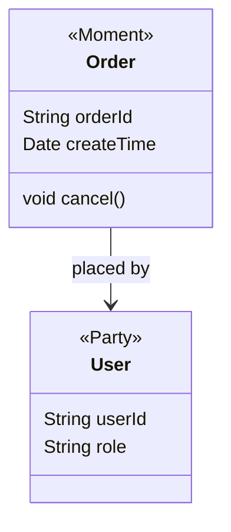

# 目录

## **一、领域驱动设计核心哲学**  
1. **战略设计与战术设计的分野**  
   • 战略设计：限界上下文（Bounded Context）与上下文映射（Context Mapping）  
   • 战术设计：实体、值对象、聚合根、领域服务的构建原则  
2. **统一语言（Ubiquitous Language）实践**  
   • 领域专家与开发团队的协作范式（Event Storming工作坊设计）  
   • 代码与文档的同步策略（Swagger + DDD Glossary）  

## **二、领域模型设计与实现**  
1. **领域模型构建方法论**  
   • **四色建模法**：时标对象（Moment-Interval）、角色（Role）、描述（Description）、参与方（Party）  
   • **事件风暴（Event Storming）**：从业务事件到领域模型的推导流程  
2. **战术模式落地**  
   • **聚合根设计**：一致性边界与并发控制（乐观锁/悲观锁策略）  
   • **领域事件**：事件溯源（Event Sourcing）与消息中间件（Kafka/RocketMQ集成）  
   • **防腐层（Anti-Corruption Layer）**：遗留系统适配与第三方服务隔离  

## **三、大厂领域驱动架构实战**  
1. **阿里电商商品中心案例**  
   • **挑战**：亿级SKU的复杂属性管理与搜索优化  
   • **方案**：  
     ◦ 商品核心域与供应链支撑域的限界上下文拆分  
     ◦ 基于领域事件的商品状态同步（Binlog + Canal实时监听）  
2. **腾讯金融支付清结算系统**  
   • **挑战**：多币种混合结算的复杂规则与审计合规  
   • **方案**：  
     ◦ 值对象模式实现货币计算（BigDecimal精度控制 + 汇率服务防腐层）  
     ◦ 聚合根事务一致性保障（Saga模式 + 分布式事务框架Seata）  
3. **美团外卖订单履约系统**  
   • **挑战**：高峰期每秒10万订单的领域状态机管理  
   • **方案**：  
     ◦ 订单聚合根的并发控制（Redis分布式锁 + 数据库行锁混合策略）  
     ◦ 领域事件驱动履约流程（订单创建 → 支付 → 派单 → 配送的状态迁移）  

## **四、DDD与现代化架构融合**  
1. **微服务架构下的DDD落地**  
   • **限界上下文与服务边界的映射关系**  
     ◦ 一上下文一服务 vs 一上下文多服务（基于团队与业务复杂度权衡）  
   • **领域模型与REST/GraphQL API的设计协同**  
     ◦ API资源模型到领域模型的转换策略（HATEOAS与领域动作的映射）  
2. **云原生与DDD的协同演进**  
   • **Sidecar模式承载防腐层逻辑**：Envoy WASM实现协议转换与数据清洗  
   • **Serverless领域函数设计**：AWS Lambda实现无状态领域服务（如风控规则引擎）  
3. **中台化架构的DDD适配**  
   • **业务中台的核心域抽象**：用户中心、商品中心、交易中心的领域服务下沉  
   • **数据中台的领域模型扩展**：基于领域事件的实时数仓构建（Flink + Hudi）  

## **五、工具链与效能提升**  
1. **DDD全生命周期工具**  
   • **设计工具**：Visual Paradigm领域建模、Miro在线事件风暴  
   • **代码生成**：IDEA插件（如DDD Plugin）自动生成聚合根/仓储代码  
   • **测试验证**：Cucumber + SpecFlow实现领域场景BDD测试  
2. **框架与中间件集成**  
   • **DDD框架选型**：COLA架构 vs Axon Framework vs 自研框架  
   • **领域事件总线**：Spring Cloud Stream与RocketMQ/Redis Stream集成  

---

---

# **一、领域驱动设计核心哲学**  

---

## **1. 战略设计与战术设计的分野**  

##### **战略设计：限界上下文与上下文映射**  
**限界上下文（Bounded Context）** 是领域驱动设计的核心战略模式，用于界定领域模型的边界。每个限界上下文对应一个独立的业务子域，拥有专属的领域模型和统一语言。  

**示例：电商系统上下文划分**  
• **商品上下文**：管理SKU、库存、类目属性。  
• **订单上下文**：处理下单、支付、履约流程。  
• **用户上下文**：负责注册、登录、权限管理。  

**上下文映射（Context Mapping）** 定义不同上下文间的交互方式，常见模式包括：  
• **合作关系（Partnership）**：两个上下文紧密协作，共享部分模型（如订单与物流）。  
• **防腐层（Anti-Corruption Layer）**：隔离外部系统或遗留代码，避免污染核心域（如集成第三方支付）。  

---

##### **战术设计：实体、值对象、聚合根的构建原则**  
• **实体（Entity）**：具有唯一标识的对象（如订单ID）。  
  ```java  
  public class Order {  
      private String orderId;  // 唯一标识  
      private OrderStatus status;  
      // 业务行为方法  
      public void cancel() {  
          this.status = OrderStatus.CANCELLED;  
      }  
  }  
  ```
• **值对象（Value Object）**：无唯一标识，通过属性定义（如地址）。  
  ```java  
  public class Address {  
      private String province;  
      private String city;  
      // 值对象相等性由属性决定  
      @Override  
      public boolean equals(Object obj) { ... }  
  }  
  ```
• **聚合根（Aggregate Root）**：一致性边界的管理者（如订单聚合根控制订单项变更）。  
  ```java  
  public class OrderAggregate {  
      private Order order;  
      private List<OrderItem> items;  
      // 保证业务规则：订单总金额≥0  
      public void addItem(OrderItem item) {  
          if (this.calculateTotal() + item.getPrice() < 0) {  
              throw new IllegalStateException("Invalid total amount");  
          }  
          this.items.add(item);  
      }  
  }  
  ```

---

## **2. 统一语言（Ubiquitous Language）实践**  

##### **领域专家与开发团队的协作范式**  
通过 **Event Storming 工作坊** 对齐业务与技术的理解：  
1. **事件风暴流程**：  
   • **识别领域事件**：如“订单已创建”、“支付已成功”。  
   • **标注命令与角色**：谁（用户/系统）触发了什么操作。  
   • **划分限界上下文**：确定事件归属的领域边界。  
2. **产出物**：  
   • 事件流图（贴在墙上的便签矩阵）。  
   • 核心领域模型初稿。  

##### **代码与文档的同步策略**  
• **Swagger 文档**：API 设计需反映领域动作（如 `/orders/{id}/cancel`）。  
• **DDD Glossary**：维护术语表，确保业务词汇在代码中一致。  
  ```markdown  
  | 术语         | 定义                          | 代码对应类       |  
  |--------------|-----------------------------|------------------|  
  | 订单         | 用户购买商品的交易凭证         | OrderAggregate   |  
  | 库存保留     | 预占商品库存以确保可售性        | InventoryService |  
  ```

---

# **二、领域模型设计与实现**  

---

## **1. 领域模型构建方法论**  

##### **四色建模法：时标对象、角色、描述、参与方**  
• **时标对象（Moment-Interval）**：记录业务关键时间点或时段（如订单创建时间）。  
• **角色（Role）**：对象在特定场景下的职责（如用户作为“买家”角色）。  
• **描述（Description）**：对象的静态属性（如商品规格参数）。  
• **参与方（Party/Place/Thing）**：参与业务的主体（如用户、仓库、物流公司）。  

**示例：电商订单四色模型**  


---

##### **事件风暴（Event Storming）推导领域模型**  
从业务事件到代码模型的转化流程：  
1. **事件抽取**：梳理业务流程中的领域事件（如 `OrderPlaced`、`PaymentCompleted`）。  
2. **命令识别**：确定触发事件的操作（如 `PlaceOrderCommand`）。  
3. **聚合根设计**：将事件和命令归属到聚合根（如 `OrderAggregate` 处理订单状态变更）。  

---

## **2. 战术模式落地**  

##### **聚合根设计：一致性边界与并发控制**  
• **一致性规则**：聚合根负责维护内部对象的状态一致性。  
  ```java  
  public class OrderAggregate {  
      private List<OrderItem> items;  
      // 添加商品时校验库存  
      public void addItem(Product product, int quantity) {  
          if (!product.isAvailable(quantity)) {  
              throw new InsufficientStockException();  
          }  
          items.add(new OrderItem(product, quantity));  
      }  
  }  
  ```
• **并发控制策略**：  
  • **乐观锁**：通过版本号（`@Version`）避免更新冲突。  
  • **悲观锁**：数据库 `SELECT FOR UPDATE` 锁定聚合根。  

##### **领域事件：事件溯源与消息中间件集成**  
• **事件溯源（Event Sourcing）**：通过事件序列重建聚合根状态。  
  ```java  
  public class OrderAggregate {  
      private List<DomainEvent> changes = new ArrayList<>();  
      public void cancel() {  
          apply(new OrderCancelledEvent(this.orderId));  
      }  
      private void apply(DomainEvent event) {  
          // 更新状态并记录事件  
          changes.add(event);  
      }  
  }  
  ```
• **Kafka集成**：发布领域事件供其他上下文订阅。  
  ```java  
  @Service  
  public class OrderEventPublisher {  
      @Autowired  
      private KafkaTemplate<String, DomainEvent> kafkaTemplate;  

      public void publish(OrderCancelledEvent event) {  
          kafkaTemplate.send("order-events", event);  
      }  
  }  
  ```

##### **防腐层（Anti-Corruption Layer）隔离第三方服务**  
**场景**：集成外部支付系统，避免其API污染核心支付域模型。  
```java  
public class PaymentAdapter {  
    // 转换外部支付接口响应为内部领域模型  
    public PaymentResult adapt(ThirdPartyPaymentResponse response) {  
        return new PaymentResult(  
            response.getStatus().equals("SUCCESS") ? PaymentStatus.SUCCESS : PaymentStatus.FAILED,  
            response.getTransactionId()  
        );  
    }  
}  
```

---

## **总结**  
本节深入解析了DDD的核心哲学与战术实践：  
• **战略设计** 通过限界上下文划分复杂业务，**战术设计** 提供可落地的代码结构。  
• **统一语言** 确保业务与技术的一致性，**事件风暴** 是团队协作的关键工具。  
• **聚合根与领域事件** 是保障一致性和扩展性的核心模式，**防腐层** 解决系统集成中的模型污染问题。  

**大厂实战经验**：  
• **阿里商品中心**：通过聚合根管理十亿级SKU的库存一致性。  
• **腾讯支付系统**：利用事件溯源实现分布式事务的最终一致性。  
• **美团订单履约**：通过防腐层隔离第三方物流接口，提升系统稳定性。  

这些模式与案例为企业构建高内聚、低耦合的领域模型提供了完整的方法论支撑。

---

# **三、大厂领域驱动架构实战**  

---

## **1. 阿里电商商品中心案例**  

#### **挑战：亿级SKU的复杂属性管理与搜索优化**  
• **问题核心**：商品属性动态扩展（如服装类目的尺码、颜色）、多维度搜索性能瓶颈。  
• **业务复杂度**：SKU属性组合爆炸（如手机型号×颜色×存储容量）。  

#### **解决方案**  
1. **限界上下文拆分**：  
   • **商品核心域**：管理基础商品信息、类目属性、SKU生成规则。  
   • **供应链支撑域**：处理库存管理、供应商协同，通过防腐层隔离ERP系统。  
   ```java  
   // 商品核心域聚合根：ProductAggregate  
   public class ProductAggregate {  
       private String productId;  
       private Map<String, Object> dynamicAttributes; // 动态属性存储  
       public void addAttribute(String key, Object value) {  
           dynamicAttributes.put(key, value);  
       }  
   }  
   ```
2. **领域事件驱动状态同步**：  
   • **Binlog监听**：通过Canal捕获MySQL变更，发布商品更新事件。  
   • **Elasticsearch同步**：消费事件更新搜索索引，实现近实时搜索（1秒内延迟）。  
   ```python  
   # Canal客户端监听Binlog  
   client = CanalClient(host='mysql-master')  
   client.subscribe("mall.product")  
   for change in client.listen():  
       emit_event(ProductUpdatedEvent(data=change.row_data))  
   ```

---

## **2. 腾讯金融支付清结算系统**  

#### **挑战：多币种混合结算与审计合规**  
• **精度问题**：多币种汇率转换导致的小数位丢失（如0.1 USD = 0.78 HKD）。  
• **审计追踪**：需记录每一笔结算的完整轨迹以满足PCI-DSS标准。  

#### **解决方案**  
1. **值对象模式实现货币计算**：  
   ```java  
   @ValueObject  
   public class Money {  
       private final BigDecimal amount;  
       private final Currency currency;  
   
       public Money add(Money other) {  
           BigDecimal converted = exchange(other); // 调用汇率服务  
           return new Money(this.amount.add(converted), this.currency);  
       }  
   }  
   ```
2. **Saga模式保障事务一致性**：  
   • **Seata分布式事务**：将结算拆分为“预扣款→汇率转换→最终结算”三个阶段。  
   • **补偿事务**：若某阶段失败，自动触发反向操作（如退款）。  
   ```java  
   @GlobalTransactional  
   public void settle(Order order) {  
       deductFunds(order);     // 阶段1：扣款  
       convertCurrency(order); // 阶段2：汇率转换  
       finalSettle(order);    // 阶段3：最终结算  
   }  
   ```

---

## **3. 美团外卖订单履约系统**  

#### **挑战：高峰每秒10万订单的并发控制与状态管理**  
• **并发冲突**：同一骑手被多个订单分配，导致状态覆盖。  
• **状态机复杂度**：订单需经历“创建→支付→派单→配送→完成”等十多个状态迁移。  

#### **解决方案**  
1. **混合锁策略**：  
   • **Redis分布式锁**：粗粒度锁保障派单阶段互斥。  
   • **数据库行锁**：细粒度锁控制订单项更新。  
   ```java  
   public void assignRider(String orderId, String riderId) {  
       String lockKey = "order_assign:" + orderId;  
       if (redisLock.tryLock(lockKey, 3)) {  
           try {  
               Order order = orderRepo.selectForUpdate(orderId); // 行锁  
               order.assignRider(riderId);  
           } finally {  
               redisLock.unlock(lockKey);  
           }  
       }  
   }  
   ```
2. **领域事件驱动状态机**：  
   • **状态迁移规则**：通过事件触发状态变更，避免硬编码。  
   ```java  
   public class OrderStateMachine {  
       @Transition(on = "PAYMENT_COMPLETED", from = "CREATED", to = "PAID")  
       public void onPaymentComplete(OrderEvent event) {  
           // 检查业务规则：如订单金额是否匹配  
       }  
   }  
   ```

---

# **四、DDD与现代化架构融合**  

---

## **1. 微服务架构下的DDD落地**  

#### **限界上下文与服务边界映射**  
• **一上下文一服务**：适用于团队独立、业务复杂度低的场景（如用户服务）。  
• **一上下文多服务**：当上下文内存在多个子域时（如订单服务拆分为订单创建、订单查询）。  

#### **API与领域模型协同设计**  
• **RESTful资源映射**：  
  ```java  
  @PostMapping("/orders/{id}/cancel")  
  public ResponseEntity<Void> cancelOrder(@PathVariable String id) {  
      orderAppService.cancel(id); // 调用领域服务  
      return ResponseEntity.ok().build();  
  }  
  ```
• **HATEOAS超媒体驱动**：  
  ```json  
  {  
    "orderId": "123",  
    "status": "PAID",  
    "_links": {  
      "cancel": { "href": "/orders/123/cancel", "method": "POST" }  
    }  
  }  
  ```

---

## **2. 云原生与DDD协同演进**  

#### **Sidecar模式实现防腐层**  
• **Envoy WASM过滤**：转换第三方协议（如SOAP→REST）。  
  ```yaml  
  # Envoy WASM配置  
  filters:  
  - name: wasm  
    config:  
      vm_config:  
         runtime: "envoy.wasm.runtime.v8"  
         code:  
           local:  
             filename: "/etc/envoy/soap_to_rest.wasm"  
  ```

#### **Serverless领域函数**  
• **AWS Lambda风控规则引擎**：  
  ```python  
  def lambda_handler(event, context):  
      risk_score = calculate_risk(event['user_id'])  
      return {"risk_level": "HIGH" if risk_score > 80 else "LOW"}  
  ```

---

## **3. 中台化架构的DDD适配**  

#### **业务中台核心域抽象**  
• **用户中心**：抽象认证、权限管理为通用领域服务。  
• **商品中心**：提供标准化的类目管理、SKU生成API。  

#### **数据中台实时数仓构建**  
• **Flink处理领域事件**：  
  ```java  
  DataStream<OrderEvent> stream = env.addSource(kafkaSource);  
  stream.keyBy(event -> event.getUserId())  
        .window(TumblingEventTimeWindows.of(Time.hours(1)))  
        .aggregate(new OrderCountAggregate());  
  ```

---

# **五、工具链与效能提升**  

---

## **1. DDD全生命周期工具**  

#### **设计工具**  
• **Visual Paradigm建模**：  
  ```mermaid  
  classDiagram  
      class Order {  
          -String orderId  
          -OrderStatus status  
          +cancel()  
      }  
      Order --> OrderItem : contains  
  ```

#### **代码生成**  
• **IDEA DDD插件**：自动生成聚合根、仓储接口。  
  ```java  
  // 自动生成仓储接口  
  public interface OrderRepository extends Repository<Order, String> {  
      Order findByOrderId(String orderId);  
  }  
  ```

#### **BDD测试验证**  
• **Cucumber场景定义**：  
  ```gherkin  
  Feature: Order Cancellation  
    Scenario: User cancels an unpaid order  
      Given an order with status "CREATED"  
      When the user cancels the order  
      Then the order status should be "CANCELLED"  
  ```

---

## **2. 框架与中间件集成**  

#### **DDD框架选型**  
• **COLA架构**：阿里开源的轻量级DDD框架，模块化清晰。  
  ```xml  
  <!-- COLA组件依赖 -->  
  <dependency>  
      <groupId>com.alibaba.cola</groupId>  
      <artifactId>cola-component-ddd</artifactId>  
      <version>4.3.1</version>  
  </dependency>  
  ```
• **Axon Framework**：支持事件溯源和CQRS，适合复杂事件驱动系统。  

#### **领域事件总线集成**  
• **Spring Cloud Stream + RocketMQ**：  
  ```yaml  
  spring:  
    cloud:  
      stream:  
        bindings:  
          orderEvent-out:  
            destination: order-events  
            content-type: application/json  
        rocketmq:  
          binder:  
            name-server: rocketmq-nameserver:9876  
  ```

---

## **总结**  
本节通过大厂实战案例与现代化架构融合，展现了DDD在复杂业务场景下的生命力：  
• **阿里商品中心**：通过限界上下文拆分与事件驱动，支撑亿级SKU管理。  
• **腾讯支付系统**：值对象与Saga模式保障金融级精度与事务一致性。  
• **美团订单履约**：混合锁策略与状态机设计应对高并发挑战。  

**未来方向**：  
• **智能化工具链**：AI辅助领域建模（如自动识别聚合根边界）。  
• **云原生深化**：Service Mesh与Serverless进一步降低防腐层实现成本。  
• **实时化数据**：Flink流处理与领域事件深度结合，驱动实时决策。  

通过工具链与框架的持续演进，DDD将持续赋能企业构建高响应力、高可维护性的业务系统。