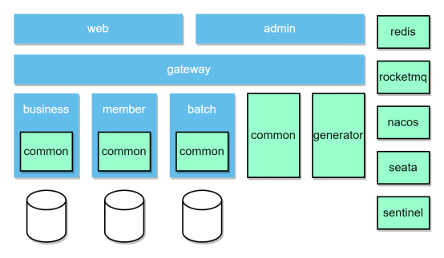

cd web; npm run web-dev 

cd admin; npm run admin-dev

cd ../nacos/bin; .\startup.cmd -m standalone

cd ../seata/bin; .\seata-server.bat

cd ..; java -jar sentinel-dashboard-1.8.6.jar

cd ../rocketmq-all-4.9.5-bin-release/bin; start mqnamesrv.cmd

cd ../rocketmq-all-4.9.5-bin-release/bin; .\mqbroker.cmd -n 127.0.0.1:9876

cd ../rocketmq-all-4.9.5-bin-release/bin; start mqbroker.cmd -n 127.0.0.1:9876 -c conf\broker.conf

## 技术栈

前后端分离

**后端**

 JDK 17

Spring Boot 3.0.0

Spring Cloud Alibaba 2022.0.0

**前端**

Vue CLI 5

Vue 3

## 核心功能

**用户端**：登录/注册，乘客管理，余票查询，车票购买，我的车票

**管理端**：车次维护(车站、车次、车厢、座位、到站)，每日车次维护(跑批自动生成)，会员管理，车票管理

## 核心模块

**网关模块**：路由转发，登录校验

**会员模块**：会员，乘客，已购车票

**业务模块**：车次数据吗，余票信息

**跑批模块**：定时任务，界面启停

**web模块**：会员界面

**admin模块**：管理控台界面

## 系统架构

## 数据库表

train-business数据库

| 表名                     | 字段说明                                                     |
| ------------------------ | ------------------------------------------------------------ |
| **station**              | id, 站名, 站名拼音, 站名拼音首字母, 新增时间, 修改时间       |
| **train**                | id, 车次编号, 车次类型, 始发站, 始发站拼音, 出发时间, 终点站, 终点站拼音, 到站时间, 新增时间, 修改时间 |
| **train_station**        | id, 车次编号, 站序, 站名, 站名拼音, 进站时间, 出站时间, 停站时长, 里程, 新增时间, 修改时间 |
| **train_carriage**       | id, 车次编号, 厢号, 座位类型, 座位数, 排数, 列数, 新增时间, 修改时间 |
| **train_seat**           | id, 车次编号, 厢序, 排号, 列号, 座位类型, 同车厢座序, 新增时间, 修改时间 |
| **daily_train**          | id, 日期, 车次编号, 车次类型, 始发站, 始发站拼音, 出发时间, 终点站, 终点站拼音, 到站时间, 新增时间, 修改时间 |
| **daily_train_station**  | id, 日期, 车次编号, 站序, 站名, 站名拼音, 进站时间, 出站时间, 停站时长, 里程, 新增时间, 修改时间 |
| **daily_train_carriage** | id, 日期, 车次编号, 箱序, 座位类型, 座位数, 排数, 列数, 新增时间, 修改时间 |
| **daily_train_seat**     | id, 日期, 车次编号, 箱序, 排号, 列号, 座位类型, 同车箱座序, 售卖情况, 新增时间, 修改时间 |
| **daily_train_ticket**   | id, 日期, 车次编号, 出发站, 出发站拼音, 出发时间, 出发站序, 到达站, 到达站拼音, 到站时间, 到站站序, 一等座余票, 一等座票价, 二等座余票, 二等座票价, 软卧余票, 软卧票价, 硬卧余票, 硬卧票价, 新增时间, 修改时间 |
| **confirm_order**        | id, 会员id, 日期, 车次编号, 出发站, 到达站, 余票ID, 车票, 订单状态, 新增时间, 修改时间 |
| **undo_log**             | id, branch_id, xid, context, rollback_info, log_status, log_created, log_modified, ext |
| **sk_token**             | id, 日期, 车次编号, 令牌余量, 新增时间, 修改时间             |

train-member数据库

| 表名          | 字段说明                                                     |
| ------------- | ------------------------------------------------------------ |
| **member**    | id, 手机号                                                   |
| **passenger** | id, 会员id, 姓名, 身份证, 旅客类型, 新增时间, 修改时间       |
| **ticket**    | id, 会员id, 乘客id, 乘客姓名, 日期, 车次编号, 箱序, 排号, 列号, 出发站, 出发时间, 到达站, 到站时间, 座位类型, 新增时间, 修改时间 |
| **undo_log**  | id, branch_id, xid, context, rollback_info, log_status, log_created, log_modified, ext |

train-batch数据库

| 表名                         | 字段说明                                                     |
| ---------------------------- | ------------------------------------------------------------ |
| **QRTZ_JOB_DETAILS**         | 定时任务名称, job名称, job组, 描述, job类名, 是否持久化, 是否非同步, 是否更新数据, 请求是否覆盖, job数据 |
| **QRTZ_TRIGGERS**            | 定时任务名称, 触发器名称, 触发器组, job名称, job组, 描述, 下一次触发时间, 前一次触发时间, 等级, 触发状态, 触发类型, 开始时间, 结束时间, 日程名称, 未触发实例, job数据 |
| **QRTZ_SIMPLE_TRIGGERS**     | 定时任务名称, 触发器名称, 触发器组, 重复执行次数, 重复执行间隔, 已经触发次数 |
| **QRTZ_CRON_TRIGGERS**       | 定时任务名称, 触发器名称, 触发器组, cron表达式, 时区         |
| **QRTZ_SIMPROP_TRIGGERS**    | 定时任务名称, 触发器名称, 触发器组, 开始配置1, 开始配置2, 开始配置3, int配置1, int配置2, long配置1, long配置2, 配置描述1, 配置描述2, bool配置1, bool配置2 |
| **QRTZ_BLOB_TRIGGERS**       | 定时任务名称, 触发器名称, 触发器组, 数据                     |
| **QRTZ_CALENDARS**           | 定时任务名称, 日程名称, 日程数据                             |
| **QRTZ_PAUSED_TRIGGER_GRPS** | 定时任务名称, 触发器组                                       |
| **QRTZ_FIRED_TRIGGERS**      | 定时任务名称, entryId, 触发器名称, 触发器组, 实例名称, 执行时间, 定时任务时间, 等级, 状态, job名称, job组, 是否异步, 是否请求覆盖 |
| **QRTZ_SCHEDULER_STATE**     | 定时任务名称, 实例名称, 最近检入时间, 检入间隔               |
| **QRTZ_LOCKS**               | 定时任务名称, lock名称                                       |

quartz相关表

seata相关表
