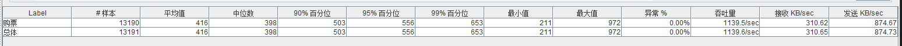

1，mybatis-plus重写crud

2，redis击穿等防范.

3，删除测试体验等代码

4，添加redis预扣减库存和数据库层面的锁，确保不超卖

5，

### 1.0 版本总结：

------

#### 1️⃣ 当前项目实现了什么

**业务功能层面**

- 完整的车票预订流程：余票查询、选座、下单、订单状态更新、会员票记录。
- JWT 登录管理，网关和服务层拦截器保证请求身份。
- 秒杀/高并发场景初步处理：
  - **令牌桶削峰**控制请求压力。
  - **Redis 分布式锁**防止并发修改同一条余票数据。
  - **消息队列（MQ）异步处理订单**，削峰和解耦前端请求与后端库存操作。
- 数据一致性保证：
  - 基于 **数据库事务**和 Seata 全局事务控制订单、座位售票和库存修改。
  - **座位售票状态二进制表示**，避免重复售票。
  - **数据库唯一索引**限制同车次同区间重复插入。

**基本一致性和不超卖**

- 库存在数据库层做判断与扣减，保证基本不超卖（单点更新+事务）。
- 座位售票状态二进制处理，保证同一区间不会重复售票。
- 消息异步化保证高并发下订单请求不会直接阻塞数据库。

------

#### 2️⃣ 当前项目的不足

**库存和订单一致性**

- **没有 Redis 预扣减库存**，仍然依赖数据库实时扣减，无法充分削峰。
- **数据库没有行级/乐观锁机制**，可能在高并发下出现超卖或死锁问题。
- **Redis/Redisson 粗粒度锁**，锁粒度大，性能瓶颈明显。
- **Seata 全局事务**在秒杀高并发场景可能拖慢性能，增加系统耦合。
- **缺少异常回退/补偿机制**，一旦部分操作失败，可能导致库存与订单不一致。

**消息与异步处理**

- MQ 消息发送未使用事务消息，本地数据库修改与 MQ 消息可能不一致。
- 消费端处理是分页拉取 + 并行处理，无法保证严格顺序，可能造成库存错乱。
- **缺少死信队列和重试机制**，消费失败时可能丢失消息。

**系统设计与优化**

- 依赖数据库事务和回滚实现一致性，未充分利用缓存削峰。
- 秒杀场景下，性能未优化到极限。
- 缺少库存预扣减、幂等性设计和高并发优化措施。

------

#### 3️⃣ 接下来需要做什么

**库存与不超卖**

- 增加 **Redis 预扣减库存**，在入库前先在缓存中判断库存。
- 数据库层增加 **行级锁或乐观锁**，确保并发扣减正确。
- 优化 Redis 锁粒度（按车次+座位粒度，而不是整车）。

**事务与一致性**

- **事务消息**结合 MQ，确保库存扣减与消息发送原子性。
- **异常补偿机制**：失败回滚库存/订单，保证一致性。
- Seata 全局事务仅在必要时使用，秒杀路径尽量使用本地事务 + 异步消息。

**高并发优化**

- 消费端严格顺序消费或者使用分区+顺序消费策略。
- 增加 **死信队列**和重试机制，确保消息不丢失。
- 使用 **令牌桶 + Redis 预扣减**，结合本地事务处理库存，提高并发吞吐量。

**缓存与性能**

- **Redis 缓存防护**：
  - **缓存穿透**：对不存在的数据使用布隆过滤器或空对象缓存，防止恶意/异常请求打穿数据库。
  - **缓存击穿**：对热点数据使用互斥锁或逻辑过期，避免高并发请求同时落库。
  - **缓存雪崩**：设置不同过期时间、使用随机 TTL，避免大量缓存同时失效。

**持久层优化**

- **MyBatis-Plus 重构**：
  - 替换原有生成器 + MyBatis 插件生成的 CRUD，减少重复代码。
  - 使用 Lambda 查询构造器、条件构造器、分页等特性，提高开发效率与代码可维护性。
  - 更利于整合库存预扣减、行级锁、幂等性控制等业务逻辑。

**其他优化**

- 增加 **幂等性设计**，确保重复请求不会导致重复扣减。
- 考虑 **读写分离 + 缓存预热**，减轻数据库压力。

------

### 压测

使用apache-jmeter-5.6.3压测

#### 1，v1未优化

保证不超卖和一致性的前提下：

| Label | #样本  | 平均值 | 中位数 | 90%百分位 | 95%百分位 | 99%百分位 | 最小值 | 最大值 | 异常% | 吞吐量     | 接收 KB/sec | 发送 KB/sec |
| ----- | ------ | ------ | ------ | --------- | --------- | --------- | ------ | ------ | ----- | ---------- | ----------- | ----------- |
| 购票  | 14352  | 803    | 781    | 957       | 1,040     | 1,088     | 173    | 1,303  | 0.00% | 1143.4/sec | 311.53      | 877.65      |
| 查票  | 66,063 | 958    | 927    | 1,079     | 1,136     | 1,185     | 177    | 1,519  | 0.00% | 1025.6/sec | 668.08      | 489.74      |

#### 2，v1优化后

保证不超卖和一致性的前提下，添加redis和MQ：

(事实证明，消息队列本身不能直接提高单个接口的吞吐量，而缓存对于查询接口的提升是巨大的。)

| Label | #样本  | 平均值 | 中位数 | 90%百分位 | 95%百分位 | 99%百分位 | 最小值 | 最大值 | 异常% | 吞吐量     | 接收 KB/sec | 发送 KB/sec |
| ----- | ------ | ------ | ------ | --------- | --------- | --------- | ------ | ------ | ----- | ---------- | ----------- | ----------- |
| 购票  | 13190  | 416    | 398    | 503       | 556       | 653       | 211    | 972    | 0.00% | 1139.5/sec | 310.62      | 874.67      |
| 查票  | 39,081 | 166    | 158    | 204       | 225       | 265       | 27     | 352    | 0.00% | 1752.9/sec | 1140.10     | 837.08      |

#### 3，v2重构后

较“v1优化后”版本，使用mp重构业务代码：

| Label | #样本  | 平均值 | 中位数 | 90%百分位 | 95%百分位 | 99%百分位 | 最小值 | 最大值 | 异常% | 吞吐量     | 接收KB/sec | 发送KB/sec |
| ----- | ------ | ------ | ------ | --------- | --------- | --------- | ------ | ------ | ----- | ---------- | ---------- | ---------- |
| 购票  | 31,193 | 427    | 417    | 529       | 560       | 679       | 203    | 1,155  | 0.00% | 1143.9/sec | 312.30     | 878.00     |
| 查票  | 74411  | 165    | 153    | 215       | 244       | 316       | 89     | 419    | 0.00% | 1801.8/sec | 1173.80    | 860.41     |

#### 4，v3优化后

